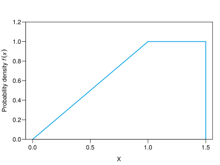

## Exercise 1

Given the continuous random variable $X$ with the following probability density function chart,

1. Check that $f(x)$ is a probability density function.
2. Calculate the following probabilities
       a.  $P(X<1)$
       b.  $P(X>0)$
       c.  $P(X=1/4)$
       d.  $P(1/2\leq X\leq 3/2)$
3. Calculate the distribution function.


1. $P(X<1)=0.5$, $P(X>0)=1$, $P(X=1/4)=0$ and $P(1/2\leq X\leq 3/2)=0.875$.  
2. 
$$
F(x)=
\begin{cases}
0 & \text{if $x<0$,} \newline
x^2/2 & \text{if $0\leq x< 1$,} \newline
x-5 & \text{if $1\leq x<1.5$,} \newline
1 & \text{if $1.5\leq x$.}
\end{cases}
$$


## Exercise 2

A worker can arrive to the workplace at any moment between 6 and 7 in the morning with the same likelihood.

1.  Compute and plot the probability density function of the variable that measures the arrival time.
2.  compute and plot the distribution function.
3.  Compute the probability of arriving before quarter past six and after half past six.
4.  What is the expected arrival time?


1. 

2. 

3. $P(X<6.25)=0.25$ and $P(X>6.5)=0.5$.  
4. $\mu=6.5$.


## Exercise 3

Let $Z$ be a random variable following a standard normal distribution model. Calculate the following probabilities using the table of the distribution function:

1.  $P(Z<1.24)$
2.  $P(Z>-0.68)$
3.  $P(-1.35\leq Z\leq 0.44)$


1.  $P(Z<1.24)=0.8925$.  
2.  $P(Z>-0.68)=0.7517$.  
3.  $P(-1.35\leq Z\leq 0.44)=0.5815$.


## Exercise 4

Let $Z$ be a random variable following a standard normal distribution model. Determine the value of $x$ in the following cases using the table of the distribution function:

1.  $P(Z<x)=0.6406$.
2.  $P(Z>x)=0.0606$.
3.  $P(0\leq Z\leq x)=0.4783$.
4.  $P(-1.5\leq Z\leq x)=0.2313$.
5.  $P(-x\leq Z\leq x)=0.5467$.


1.  $x=0.3601$.  
2.  $x=1.5498$.  
3.  $x=2.0198$.  
4.  $x=-0.5299$.  
5.  $x=0.7499$.


## Exercise 5

Let $X$ be a random variable following a normal distribution model $N(10,2)$.

1.  Calculate $P(X\leq 10)$.
2.  Calculate $P(8\leq X\leq 14)$.
3.  Calculate the interquartile range.
4.  Calculate the third decile.


1.  $P(X\leq 10)=0.5$.  
2.  $P(8\leq X\leq 14)=0.8186$.  
3.  $IQR=2.698$.  
4.  $D_3=8.9512$.


## Exercise 6

It is known that the glucose level in blood of diabetic persons follows a normal distribution model with mean 106 mg/100 ml and standard deviation 8 mg/100 ml.

1.  Calculate the probability of a random diabetic person having a glucose level less than 120 mg/100 ml.
2.  What percentage of persons have a glucose level between 90 and 120 mg/100 ml?
3.  Calculate and interpret the first quartile of the glucose level.


1.  $P(X\leq 120)=0.9599$.  
2.  $P(90\leq X\leq 120)=0.9372 \Rightarrow 93.72\%$.  
3.  $Q_1=100.6041$ mg/100 ml. 


## Exercise 7

It is known that the cholesterol level in males 30 years old follows a normal distribution with mean 220 mg/dl and standard deviation 30 mg/dl. If there are 20000 males 30 years old in the population,

1.  how many of them have a cholesterol level between 210 and 240 mg/dl?
2.  If a cholesterol level greater than 250 mg/dl can provoke a thrombosis, how many of them are at risk of thrombosis?
3.  Calculate the cholesterol level above which 20% of the males are?


1. $P(210\leq X\leq 240)=0.3781 \Rightarrow 7561.3$ persons.  
2. $P(X> 250)=0.1587 \Rightarrow 3173.1$ persons.  
3. $P_{80}=245.2486$ mg/dl.


## Exercise 8

In an exam done by 100 students, the average grade is 4.2 and only 32 students pass. Assuming that the grade follows a normal distribution model, how many students got a grade greater than 7?


$P(X>7)=0.0508 \Rightarrow 5.1$ students.


## Exercise 9

In a population with 40000 persons, 2276 have between 0.8 and 0.84 milligrams of bilirubin per deciliter of blood, and 11508 have more than 0.84. Assuming that the level of bilirubin in blood follows a normal distribution model,

1.  Calculate the mean and the standard deviation.
2.  How many persons have more than 1 mg of bilirubin per dl of blood?


1. $\mu=0.7001$ mg/dl and $s=0.2497$ mg/dl.  
2. $P(X>1)=0.1149 \Rightarrow 11.5$ persons.


## Exercise 10

It is known that the blood pressure of people in a population with 20000 persons follows a normal distribution model with mean 13 mm Hg and interquartile range 4 mm Hg.

1.  How many persons have a blood pressure above 16 mm Hg?
2.  How much have to decrease the blood pressure of a person with 16 mm Hg in order to be below the 40% of people with lowest blood pressure?


1. $P(X>16)=0.1587 \Rightarrow 3174$ persons.  
2. $D_4 = 12.25$ mm Hg, so, must decrease a least $3.75$ mm Hg.


## Exercise 11

A study tries to determine the effect of a low fat diet in the lifetime of rats. The rats where divided into two groups, one with a normal diet and another with a low fat diet. It is assumed that the lifetimes of both groups are normally distributed with the same variance but different mean. If 20% of rats with normal diet lived more than 12 months, 5% less than 8 months, and 85% of rats with low fat diet lived more than 11 months,

1.  what is the mean and the standard deviation of the lifetime of rats following a low fat diet?
2.  If 40\% of the rats were under a normal diet, and 60\% of rats under a low fat diet, what is the probability that a random rat die before 9 months?


Naming $X_1$ and $X_2$ to the lifetime of rats with a normal diet and a low fat diet respectively,
1. $\mu_2=12.6673$ months and $s=1.6087$ months.  
2. $P(X<9)=0.068$.


## Exercise 12

A diagnostic test to determine doping of athletes returns a positive outcome when the concentration of a substance in blood is greater than 4 $\mu$g/ml. If the distribution of the substance concentration in doped athletes follows a normal distribution model with mean 4.5 $\mu$g/ml and standard deviation 0.2 $\mu$g/ml, and in non-doped athletes is normally distributed with mean 3 $\mu$g/ml and standard deviation 0.3 $\mu$g/ml,

1.  what is the sensitivity and specificity of the test?
2.  If there is a 10% of doped athletes in a competition, what is the positive predicted value?


Naming $D$ to the event of being doped, $X$ to the concentration in doped athletes and $Y$ to the concentration in non-doped athletes,  
1. Sensitivity $P(+\vert D) = P(X>4)=0.9938$ and specificity $P(-\vert \bar D)=P(Y<4)=0.9996$  
2. PPV $P(D\vert +) = 0.9961$.


## Exercise 13

According to the central limit theorem, for big samples ($n\geq 30$) the sample mean $\bar x$ follows a normal distribution model $N(\mu,\sigma/\sqrt{n})$, where $\mu$ is the population mean and $\sigma$ the population standard deviation.

It is known that in a population the sural triceps elongation follows has mean 60 cm and standard deviation 15 cm. If you draw a sample of 30 individuals from this population, what is the probability of having a sample mean greater than 62 cm? If a sample is atypical if its mean is below the 5th percentile, is atypical a sample of 60 individuals with $\bar x=57$?


$P(\bar x>62) = 0.2326$.  
$P_{5}=56.8148$, so, the sample is non-atypical. 


## Exercise 14

The curing time of a knee injury in soccer players follows a normal distribution model with mean 50 days and standard deviation 10 days. If there is a final match in 65 days, what is the probability that a player that has just injured his knee will miss the final? If the semifinal match is in 40 days, and 4 players has just injured the knee, what is the probability that some of them can play the semifinal?


Let $X$ be the curing time, $P(X>65)=0.0668$.  
Let $Y$ be the number of injured players that could play the semifinal, $P(Y\geq 1)=0.4989$. 


