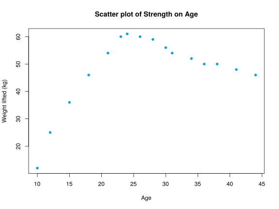

## Exercise 1

Give some examples of:

1.  Non related variables.
2.  Variables that are increasingly related.
3.  Variables that are decreasingly related.


1. The daily averge temperature and the daily number of births in a city.
2. The hours preparing an exam and the score. 
3. The weight of a person and the time require to run 100 meters. 


## Exercise 2
In a study about the effect of different doses of a medicament, 2 patients got 2 mg and took 5 days to cure, 4 patients got 2 mg and took 6 days to cure, 2 patients got 3 mg ant took 3 days to cure, 4 patients got 3 mg and took 5 days to cure, 1 patient got 3 mg and took 6 days to cure, 5 patients got 4 mg and took 3 days to cure and 2 patients got 4 mg and took 5 days to cure.

1.  Construct the joint frequency table.
2.  Get the marginal frequency distributions and compute the main statistics for each variable.
3.  Compute the covariance and interpret it.


1.

$$
\begin{array}{c|c|c|c}
\hline
\mbox{dose/days} & 3 & 5 & 6\newline
\hline
2 & 0 & 2 & 4\newline
\hline
3 & 2 & 4 & 1\newline
\hline
4 & 5 & 2 & 0\newline
\hline
\end{array}
$$

2. 
$$
\begin{array}{c|c|c|c|c}
\hline
\mbox{dose/days}  & 3 & 5 & 6 & \mbox{Sum}\newline
\hline
2 & 0 & 2 & 4 & 6\newline
\hline
3 & 2 & 4 & 1 & 7\newline
\hline
4 & 5 & 2 & 0 & 7\newline
\hline
\mbox{Sum} & 7 & 8 & 5 & 20\newline
\hline
\end{array}
$$

Dose: $\bar x=3.05$ mg, $s_x^2=0.6475$ mg$^2$, $s_x=0.8047$ mg. 
Days: $\bar y=4.55$ days, $s_y^2=1.4475$ days$^2$, $s_y=1.2031$ days. 
3. $s_{xy}=-0.6775$ mg$\cdot$days.


## Exercise 3
The table below shows the two-dimensional frequency distribution of a sample of 80 persons in a study about the relation between the blood cholesterol ($X$) in mg/dl and the high blood pressure ($Y$).

$$
\begin{array}{|c||c|c|c||c|}
\hline
X\setminus Y & [110,130) & [130,150) & [150,170) & n_x \newline
\hline\hline
[170,190)   &           &     4     &           & 12\newline
\hline
[190,210)   &    10     &    12     &     4     &   \newline
\hline
[210,230)   &     7     &           &     8     &   \newline
\hline
[230,250)   &     1     &           &           & 18\newline
\hline\hline
n_y          &           &    30     &    24    &    \newline
\hline
\end{array}
$$

1. Complete the table.
2. Construct the linear regression model of cholesterol on pressure.
3. Use the linear model to calculate the expected cholesterol for a person with pressure 160 mmHg.
4. According to the linear model, what is the expected pressure for a person with cholesterol 270 mg/dl?

Use the following sums: $\sum x_i=16960$ mg/dl, $\sum y_j=11160$ mmHg, $\sum x_i^2=3627200$ (mg/dl)$^2$, $\sum  y_j^2=1576800$ mmHg$^2$ y $\sum x_iy_j=2378800$ mg/dl$\cdot$mmHg.


1. 
$$
\begin{array}{|c||c|c|c||c|}
\hline
X\setminus Y & [110,130) & [130,150) & [150,170) & n_x \newline
\hline\hline
[170,190)   &    8       &     4     &     0      & 12\newline
\hline
[190,210)   &    10     &    12     &     4     &  26 \newline
\hline
[210,230)   &     7     &     9      &     8     &  24 \newline
\hline
[230,250)   &     1     &     5      &     12    & 18\newline
\hline\hline
n_y          &    26   &    30     &    24    & 80\newline
\hline
\end{array}
$$

2. 

$\bar x=212$ mg/dl, $s_x^2=396$ (mg/dl)$^2$. 
$\bar y=139.5$ mmHg, $s_y^2=249.75$ mmHg$^2$. 
$s_{xy}=161$ mg/dl$\cdot$mmHg. 
Regression line of cholesterol on blood pressure: $x=122.0721 + 0.6446y$. 
3. $x(160)=225.2152$ mg/dl. 
4.

Regression line of blood pressure on cholesterol: $y=53.3081 + 0.4066x$. 
$y(270)=163.0808$ mmHg.


## Exercise 4
A research study has been conducted to determine the loss of activity of a drug. The table below shows the results of the experiment.

$$
\begin{array}{lrrrrr}
\hline
\mbox{Time (in years)} & 1 & 2 & 3 & 4 & 5 \newline 
\mbox{Activity (\%)} & 96 & 84 & 70 & 58 & 52 \newline 
\hline
\end{array}
$$

1. Construct the linear regression model of activity on time.
2. According to the linear model, when will the activity be 80%? When will the drug have lost all activity?


1. $\bar x=3$ years, $s_x^2=2$ years$^2$. 
$\bar y=72$ %, $s_y^2=264$ %$^2$. 
$s_{xy}=-22.8$ years$\cdot$%. 
Regression line of activity on time: $y=106.2 + -11.4x$. 
2. 

Regression line of time on activity: $x=9.2182 + -0.0864y$. 
$x(80)=2.3091$ years and $x(0)=9.2182$ years.


## Exercise 5
A basketball team is testing a new stretching program to reduce the injuries during the league. The data below show the daily number of minutes doing stretching exercises and the number of injuries along the league.

$$
\begin{array}{lrrrrrrrr}
\hline
\mbox{Stretching minutes} & 0 & 30 & 10 & 15 & 5 & 25 & 35 & 40\newline
\mbox{Injuries} & 4 & 1 & 2 & 2 & 3 & 1 & 0 & 1\newline
\hline
\end{array}
$$

1. Construct the regression line of the number of injuries on the time of stretching.
2. How much is the reduction of injuries for every minute of stretching?
3. How many minutes of stretching are require for having no injuries? Is reliable this prediction?

Use the following sums ($X$=Number of minutes stretching, and $Y$=Number of injuries): $\sum x_i =160$ min, $\sum y_j=14$ injuries, $\sum x_i^2=4700$ min$^2$, $\sum y_j^2=36$ injuries$^2$ and $\sum x_iy_j=160$ min$\cdot$injuries.


1. $\bar x=20$ min, $s_x^2=187.5$ min$^2$. 
$\bar y=1.75$ injuries, $s_y^2=1.4375$ injuries$^2$. 
$s_{xy}=-15$ min$\cdot$injuries. 
Regression line of injuries on time of stetching: $y=3.35 + -0.08x$. 
2. $0.08$ injuries/min. 
3.

Regression line of time of stretching on injuries: $x=38.2609 + -10.4348y$. 
$x(0)=38.2609$ min. 
$r^2=0.8348$.


## Exercise 6
For two variables $X$ and $Y$ we have

- The regression line of $Y$ on $X$ is $y-x-2=0$.
- The regression line of $X$ on $Y$ is $y-4x+22=0$.

Calculate:

1. The means $\bar x$ and $\bar y$.
2. The correlation coefficient.


1. $\bar x=8$ and $\bar y=10$. 
2. $r=0.5$.


## Exercise 7
The means of two variables $X$ and $Y$ are $\bar x=2$ and $\bar y=1$, and the correlation coefficient is 0.

1. Predict the value of $Y$ for $x=10$.
2. Predict the value of $X$ for $y=5$.
3. Plot both regression lines.


1. $y(10)=1$. 
2. $x(5)=2$.


## Exercise 8
A study to determine the relation between the age and the physical strength gave the scatter plot below.

1. Calculate the linear coefficient of determination for the whole sample.
2. Calculate the linear coefficient of determination for the sample of people younger than 25 years old.
3. Calculate the linear coefficient of determination for the sample of people older than 25 years old.
4. For which age group the relation between age and strength is stronger? 

Use the following sums ($X$=Age and $Y=$Weight lifted).

- Whole sample: $\sum x_i=431$ years, $\sum y_j=769$ Kg, $\sum x_i^2=13173$ years$^2$, $\sum y_j^2=39675$ Kg$^2$ and $\sum x_iy_j=21792$ years$\cdot$Kg.

- Young people: $\sum x_i=123$ years, $\sum y_j=294$ Kg, $\sum x_i^2=2339$ years$^2$, $\sum y_j^2=14418$ Kg$^2$ and $\sum x_iy_j=5766$ years$\cdot$Kg.

- Old people: $\sum x_i=308$ years, $\sum y_j=475$ Kg, $\sum x_i^2=10834$ years$^2$, $\sum y_j^2=25257$ Kg$^2$ and $\sum x_iy_j=16026$ years$\cdot$Kg.


1. $\bar x=26.9375$ years, $s_x^2=97.6836$ years$^2$. 
$\bar y=48.0625$ kg, $s_y^2=169.6836$ kg$^2$. 
$s_{xy}=67.3164$ years$\cdot$kg. 
$r^2=0.2734$. 
2. $\bar x=17.5714$ years, $s_x^2=25.3878$ years$^2$. 
$\bar y=42$ kg, $s_y^2=295.7143$ kg$^2$. 
$s_{xy}=85.7143$ years$\cdot$kg. 
$r^2=0.9786$. 
3. $\bar x=34.2222$ years, $s_x^2=32.6173$ years$^2$. 
$\bar y=52.7778$ kg, $s_y^2=20.8395$ kg$^2$. 
$s_{xy}=-25.5062$ years$\cdot$kg. 
$r^2=0.9571$. 
4. The linear relation between the age and the physical strength is a little bit stronger in the group of young people.

