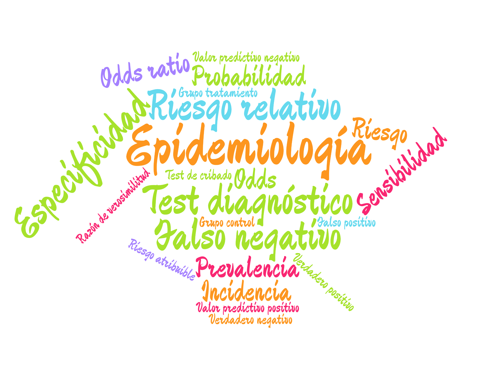
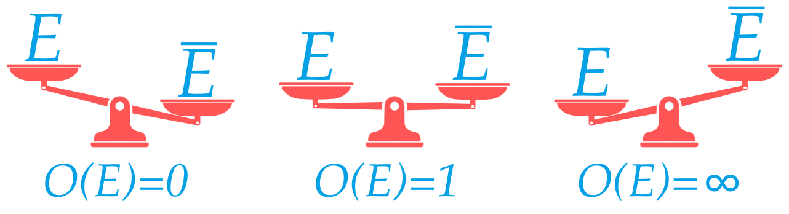
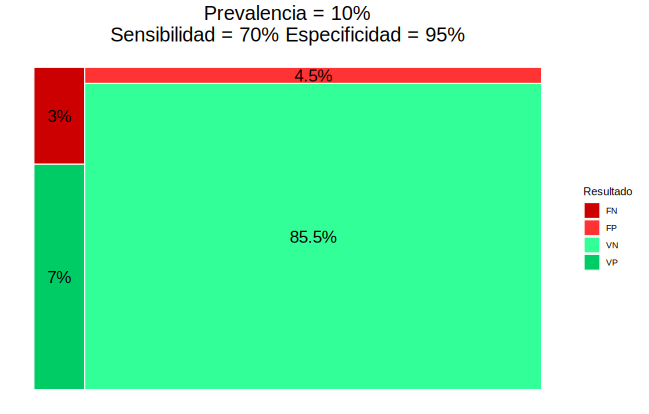

## ¿Qué es la Epidemiología?

Epidemiología viene Griego: Epi (sobre), demos (gente) y logos (estudio), es decir, el estudio de lo que le ocurre a las poblaciones.

> En el ámbito de la salud pública, la **Epidemilogía** es una rama de la Medicina que se encarga del estudio de la distribución y las causas de eventos relacionados con la salud (normalmente enfermedades) en las poblaciones, y la aplicación de este estudio para controlar problemas públicos de salud.

Debido a la epidemia provocada por el coronavirus, la Epidemia se ha convertido en una de las rama de la medicina que más interés despiertan.

Sin embargo, antes de la COVID, la Epidemiología ya había servido en otros momentos históricos para solucionar o controlar algunos de los problemas de salud públicos más serios que ha enfrentado la humanidad.

### Algunos descubrimientos históricos

- 1854: John Snow determina que la causa de la epidemia de cólera que asolaba Lóndres era que el agua estaba contaminada con heces.
- 1898: Ronald Ross averigua que el transmisor de la malaria es el el mosquito Anopheles.
- 1950: Se descubre que fumar es el principal factor de riesgo de cáncer de pulmón.
- 1954: Se valida la primera vacuna contra la poliomielitis (Jonas Salk’s).
- 1970: Se observó que el ejercicio físico y una dieta sana reducían el riesgo de sufrir un infarto.
- 1983: Robert Gallo, Luc Montagnier y Françoise Barré-Sinoussi identifican el virus que causa el SIDA. Poco después se se observó que el riesgo de contraer el HIV aumentaba con ciertas prácticas sexuales y con el consumo de algunos tipos de drogas.
- 2020: Y llegó la COVID...

En estos tiempos de pandemia un montón de términos técnicos de la epidemiología se han convertido en lugares comunes gracias a los medios de comunicación.

Sin embargo, muchos de estos términos se utilizan de manera errónea, incluso por los propios medios de comunicación, y generan confusión para la población no experta. En este tutorial pretendo explicar los principales conceptos epidemiológicos usados en el control de enfermedades como la COVID e ilustrar su uso con ejemplos de aplicación.

## Índices epidemiológicos

**Riesgos**

- Prevalencia
- Incidencia
- Riesgo y Odds
- Riesgo/Odd relativo

**Test diagnósticos**

- Sensibilidad
- Especificidad
- Valores predictivos

Todos estos índices estan basados en el cálculo de probabilidades, por lo que comenzaremos introduciendo el concepto de probabilidad y sus principales propiedades.

## El concepto de probabilidad

A lo largo de la historia ha habido diferentes intentos de definir matemáticamente el concepto de probabilidad. Quizá la más conocida y la primera que se enseña en las escuelas es la definición clásica de Laplace.

{}
**Definición clásica (Laplace)** $$P(E)=\frac{|E|}{|\Omega|}=\frac{\mbox{Casos favorables a $E$}}{\mbox{Casos posibles}}$$
{}

**Ejemplo** Al tirar un dado equilibrado, la probabilidad de sacar un número par $E=\\{2, 4, 6\\}$ es
$$ P(E) = \frac{3}{6} = 0.5$$ 

Sin embargo, esta definición tiene serios inconvenientes ya que, para poder usarla, todos los casos posibles de un experimento deben tener la misma probabilidad de ocurrir (_equiprobabilidad_) y esto no suele ocurrir en la vida real (por ejemplo no todos los grupos sanguíneos tienen la misma probabilidad de ocurrir).

Por este motivo, en el ámbito de las Ciencias es mucho más común utilizar la definición de probabilidad basada en el cálculo de frecuencias.

{}
**Definición frecuentista** $$P(E)\approx f_E = \frac{n_E}{n}=\frac{\mbox{Frecuencia absoluta del evento}}{\mbox{Tamaño muestral}}$$
{}

**Ejemplo** Se ha aplicado un tratamiento a 100 personas y se han curado 75, entonces la probabilidad de curación del tratamiento es
$$P(E) = \frac{75}{100} = 0.75 \Rightarrow 75\\%$$ 

<i class="fa fa-exclamation-triangle" style="color:#ff9900;"></i>Ojo, esta definición no permite calcular el valor exacto de la probabilidad de un suceso, tan solo una aproximación que será mejor cuanto mayor sea el tamaño de la muestra.

### Algunas propiedades de la probabilidad

- Una probabilidad es un número real entre 0 y 1: $$0\leq P(E)\leq 1$$  

- La suma de las probabilidades de todos los casos posibles es 1: $$P(\Omega) = P(e_1) + P(e_2) + \cdots + P(e_n) = 1$$ 

- La probabilidad de que ocurra lo contrario de un suceso es 1 menos la probabilidad del suceso: $$P(\overline E) = 1 - P(E)$$

De este modo, cuanto más probable es que ocurra un suceso, menos probable es que ocurra su contrario, y viceversa.

### Interpretación de una probabilidad

La probabilidad mide la verosimilitud de un suceso.

De manera informal, se puede decir que la probabilidad mide la creencia o la confianza que tenemos en la ocurrencia de un suceso.

- $P(E) = 0 \Rightarrow$ Mínima verosimilitud
- $P(E) = 0.5 \Rightarrow$ Verosimilitud media (máxima incertidumbre)
- $P(E) = 1 \Rightarrow$ Máxima verosimilitud

Aunque el concepto de probabilidad es el más extendido en aplicaciones que requieren cuantificar la incertidumbre sobre la ocurrencia de un suceso, existen otras formas de cuantificar esa incertidumbre como por ejemplo el _odds_.

## El concepto de Odds

{}
**Definición: Odds** $$O(E)=\frac{\mbox{Nº casos con $E$}}{\mbox{Nº casos sin $E$}}=\frac{P(E)}{P(\overline E)}$$
{}

**Ejemplo** Se ha aplicado un tratamiento a 100 personas y se han curado 75, entonces el odds de curación del tratamiento es $$O(E) = \frac{75}{25} = 3$$ 

<i class="fa fa-exclamation-triangle" style="color:#ff9900;"></i> Un odds puede ser mayor que 1. 

### Interpretación de un Odds

Los odds también permiten cuantificar la verosimilitud de un suceso..., pero en una escala diferente, ya que es una razón de probabilidades.

- $O(E) = 0 \Rightarrow$ Mínima verosimilitud
- $O(E) = 1 \Rightarrow$ Verosimilitud media (máxima incertidumbre)
- $O(E) = \infty \Rightarrow$ Máxima verosimilitud

### Conversión de Odds en probabilidades

Es posible convertir un odds en una probabilidad aplicando la siguiente fórmula:

$$ \frac{O(E)}{1 + O(E)} = \frac{\frac{P(E)}{P(\overline E)}}{1 + \frac{P(E)}{P(\overline E)}} = \frac{\frac{P(E)}{P(\overline E)}}{\frac{P(\overline E) + P(E)}{P(\overline E)}} = P(E)$$

**Ejemplo** Se ha aplicado un tratamiento a 100 personas y se han curado 75.
$$O(E) = \frac{75}{25} = 3 \Rightarrow P(E) = \frac{3}{1+3}=0.75$$ 

## Prevalencia

{}
**Definición: Prevalencia**  
La _prevalencia_ de una enfermedad $E$ es la proporción de personas que tienen la enfermedad en un momento concreto.
$$\mbox{Prevalencia}(E) = \frac{\mbox{Nº individuos afectados por $E$}}{\mbox{Tamaño poblacional}}$$
{}

**Ejemplo**. En una muestra de 1000 personas 150 tenían gripe. La prevalencia de la gripe es aproximadamente $$\frac{150}{1000}=0.15$$ 

## Incidencia o riesgo absoluto

{}
**Definición: Incidencia**  
La _incidencia_ o _riesgo absoluto_ de una enfermedad $E$ es la proporción de nuevos casos durante un periodo determinado (por día, por semana, por mes, etc.)
$$R(E)=\frac{\mbox{Nº nuevos casos con $E$ en el periodo}}{\mbox{Tamaño población en riesgo al comienzo del periodo}}$$
{}

**Ejemplo**. Al comienzo del año se tomó una muestra de 1000 personas sin gripe y al finalizar el año 80 tuvieron gripe. La incidencia de la gripe ese año fue
$$ R(E) = \frac{80}{1000} = 0.08$$ 

### Prevalencia vs Incidencia

|             | Tiempo  |        Casos        | Tipo estudio |
| ----------- | :-----: | :-----------------: | :----------: |
| Prevalencia | Puntual | Nuevos y existentes | Transversal  |
| Incidencia  | Periodo |     Solo nuevos     | Longitudinal |

- La prevalencia muestra el número de personas afectadas (carga de la enfermedad).
- La incidencia muestra la evolución de la enfermedad y es más útil para detectar brotes y estudiar su causa.
- La incidencia depende solo de la contagiosidad de la enfermedad, mientras que la prevalencia depende también de la duración de la enfermedad y de lo agresiva que sea.

<!-- $$ P(E) < R(E) $$ -->

### Algunas consideraciones en el caso de la COVID

[Datos del ministerio de sanidad](https://www.mscbs.gob.es/profesionales/saludPublica/ccayes/alertasActual/nCov/situacionActual.htm)

La incidencia de la COVID se suele dar sobre un periodo de dos semanas (14 días) aunque no siempre.

Los datos son poco precisos y subestiman el riesgo de la COVID:

- Muchos asintomáticos no son detectados.
- La detección de casos es mediante test diagnósticos que tienen un margen de error (falsos positivos y falsos negativos).
- Se calcula dividiendo por el tamaño de la población (nuevos casos por cada 100000 habitantes) pero habría que dividir por el tamaño de la población en riesgo (sin contar ya infectados o inmunizados).

## Comparación de riesgos

Tanto la prevalencia como la incidencia permiten estudiar la magnitud y la evolución de una enfermedad pero no permiten analizar las posibles causas. Cuando se quiere investigar si la exposición a un determinado factor puede influir en el desarrollo de una enfermedad hay que comparar los riesgos en dos grupos:

- Grupo tratamiento $T$: Individuos expuestos a un factor.
- Grupo control $C$: Individuos no expuestos al factor.

$$
\begin{array}{|l|cc|}
\hline
& E & \overline E\newline
\hline
T & a & b\newline
C & c & d\newline
\hline
\end{array}
$$

## Riesgo relativo

{}
**Definición: Riesgo relativo**
$$RR(E)=\frac{\mbox{Riesgo grupo tratamiento}}{\mbox{Riesgo grupo control}}=\frac{R_T(E)}{R_C(E)}=\frac{a/(a+b)}{c/(c+d)}$$
{}

**Ejemplo**.

$$
\begin{array}{|l|cc|}
\hline
& \mbox{Gripe } G & \mbox{No gripe }\overline E\newline
\hline
\mbox{Vacunados } T & 20 & 480 \newline
\mbox{No vacunados } C & 80 & 420 \newline
\hline
\end{array}
$$

$$RR(G) = \frac{20/(20+480)}{80/(80+420)} = 0.25$$

### Interpretación del riesgo relativo

- $RR=1$ $\Rightarrow$ No hay asociación entre el suceso y la exposición al factor.
- $RR<1$ $\Rightarrow$ La exposición al factor disminuye el riesgo del suceso.
- $RR>1$ $\Rightarrow$ La exposición al factor aumenta el riesgo del suceso.

## Odds ratio

Del mismo modo que se pueden comparar los riesgos en los grupos tratamiento y control, se pueden comparar también los odds.

{}
**Definición: Odds ratio**
$$OR(E)=\frac{\mbox{Odds grupo tratamiento}}{\mbox{Odds grupo control}}=\frac{O_T(E)}{O_C(E)}=\frac{a/b}{c/d}=\frac{ad}{bc}$$
{}

**Ejemplo**. 

$$
\begin{array}{|l|cc|}
\hline
& \mbox{Gripe } G & \mbox{No gripe }\overline E\newline
\hline
\mbox{Vacunados } T & 20 & 480 \newline
\mbox{No vacunados } C & 80 & 420 \newline
\hline
\end{array}
$$

$$OR(G) = \frac{20/480}{80/420} = 0.22$$

### Interpretación del odds ratio

- $OR=1$ $\Rightarrow$ No existe asociación entre el suceso y la exposición al factor.
- $OR<1$ $\Rightarrow$ La exposición al factor disminuye el riesgo del suceso.
- $OR>1$ $\Rightarrow$ La exposición al factor aumenta el riesgo del suceso.

### Riesgo relativo vs odds ratio

El riesgo relativo es una comparación de probabilidades pero depende de la incidencia de la enfermedad.

La interpretación del odds ratio es más enrevesada porque es contrafactual, ya que da cuántas veces es más frecuente el suceso en el grupo tratamiento en comparación con el control, asumiendo que en el
grupo control es tan frecuente que ocurra el suceso como que no. Su ventaja es que no depende de la incidencia de la enfermedad.

**Ejemplo**. Para estudiar la asociación entre fumar y el cáncer de pulmón se han tomado dos muestras, la segunda con el doble de pacientes sanos que la primera.

$$
\begin{array}{|l|cc|}
\hline
\textbf{Muestra 1} & \mbox{Cáncer } E & \mbox{No cáncer }\overline E\newline
\hline
\mbox{Fumadores }  & 60 & 80 \newline
\mbox{No fumadores } C & 40 & 320 \newline
\hline
\end{array}
$$

$$
\begin{aligned}
RR(E) &= \frac{60/(60+80)}{40/(40+320)} = 3.86
\newline
OR(E) &= \frac{60/80}{40/320} = 6
\end{aligned}
$$

$$
\begin{array}{|l|cc|}
\hline
\textbf{Muestra 2} & \mbox{Cáncer } E & \mbox{No cáncer }\overline E\newline
\hline
\mbox{Fumadores }  & 60 & 160 \newline
\mbox{No fumadores } C & 40 & 640 \newline
\hline
\end{array}
$$

$$
\begin{aligned}
RR(E) &= \frac{60/(60+160)}{40/(40+640)} = 4.64
\newline
OR(E) &= \frac{60/160}{40/640} = 6 
\end{aligned}
$$

### Aplicación a la COVID

- [La edad aumenta la gravedad](https://www.npr.org/sections/coronavirus-live-updates/2020/03/22/819846180/study-calculates-just-how-much-age-medical-conditions-raise-odds-of-severe-covid?t=1614095513052)
- [El riesgo de infección depende del grupo sanguíneo](https://www.aarp.org/espanol/salud/enfermedades-y-tratamientos/info-2020/tipo-de-sangre-y-riesgo-de-covid.html)
- [El déficit de vitamina D aumenta el riesgo de infección](https://medicalxpress.com/news/2021-01-vitamin-d-deficiency-covid-.html)
- [Las personas con demencia tienen mayor riesgo de infectase](https://www.sciencedaily.com/releases/2021/02/210209083524.htm)
- [El Remdesivir acelera la recuperación](https://www.nejm.org/doi/full/10.1056/NEJMoa2007764)

## Tests diagnósticos

Otra aplicación de la Epidemiología basado en el cálculo de probabilidades son los _test diagnósticos_.

> Un test diagnóstico es un test usado para diagnosticar una enfermedad o descartarla.  

Normalmente producen dos resultados: positivo (+) a favor de la enfermedad y negativo (-) en contra de ella.

$$
\begin{array}{|l|cc|}
\hline
\mbox{Test} & E & \overline E\newline
\hline
\mbox{Positivo }+ & \color{green}{\mbox{Verdadero positivo }VP} & \color{red}{\mbox{Falso positivo }FP}  \newline
\mbox{Negativo }- & \color{red}{\mbox{Falso negativo }FN} & \color{green}{\mbox{Verdadero negativo }VN}\newline
\hline
\end{array}
$$

## Sensibilidad y especificidad de un test

La fiabilidad de un test diagnóstico depende de las siguientes probabilidades.

{}
**Definición: Sensibilidad**  
La _sensibilidad_ de un test diagnóstico es la proporción de resultados positivos del test en personas con la enfermedad,
$$P(+|E)=\frac{VP}{VP+FN}$$
{}

{}
**Definición: Especificidad**  
La _especificidad_ de un test diagnóstico es la proporción de resultados negativos del test en personas sin la enfermedad,
$$P(-|\overline{E})=\frac{VN}{VN+FP}$$
{}

**Ejemplo**. Un test de antígenos para detectar el SARS-COV-2 tiene una sensibilidad del 70% y una especificidad del 95%.

- Si aplicamos el test a 100 enfermos dará 70 positivos y 30 negativos.
- Si aplicamos el test a 100 sanos dará 95 negativos y 5 positivos.

La fiabilidad del test depende también de la prevalencia de la enfermedad.

**Ejemplo**. Utilizando el test del ejemplo anterior en una población de 1000 personas y suponiendo una prevalencia del 1% se tiene

$$
\begin{array}{|l|cc|}
\hline
\mbox{Test} & E & \overline E\newline
\hline
\mbox{Positivo }+ & 7 & 50 \newline
\mbox{Negativo }- & 3 & 940\newline
\hline
\end{array}
$$

Mientras que si la prevalencia es del 10% se tiene

$$
\begin{array}{|l|cc|}
\hline
\mbox{Test} & E & \overline E\newline
\hline
\mbox{Positivo }+ & 70 & 45 \newline
\mbox{Negativo }- & 30 & 855\newline
\hline
\end{array}
$$

Para ver los resultados de un test diagnóstico en función de la prevalencia, la sensibilidad y la especificidad se puede utilizar esta [aplicación para test diagnósticos](http://nube.aprendeconalf.es/shiny/diagnostic-test/)

### Cuándo usar un test más sensible o más específico

Una mayor sensibilidad aumenta el número de verdaderos positivos y disminuye el número de falsos negativos, mientras que una mayor especificidad aumenta el número de verdaderos negativos y disminuye el número de falsos positivos. Por tanto, utilizaremos un test más sensible cuando:

- La enfermedad es grave o muy contagiosa y es importante detectarla.

- La enfermedad es curable.

- Los falsos positivos no provocan traumas serios.

Y utilizaremos un test más específico cuando:

- La enfermedad es importante pero difícil o imposible de curar.

- Los falsos positivos pueden provocar traumas serios.

- El tratamiento de los falsos positivos puede tener graves consecuencias.

Tanto la sensibilidad como la especificidad son indicadores de la fiabilidad de un test a priori, es decir, antes de aplicar el test. Una vez que el test se ha aplicado y se conoce su resultado, a la hora de diagnosticar la enfermedad o rechazarla, es mejor utilizar los _valores predictivos_.

## Valores predictivos de un test

{}
**Definición: Valor predictivo positivo**  
El _valor predictivo positivo_ de un test diagnóstico es la proporción de personas con la enfermedad entre las personas con resultado positivo en el test,
$$P(E|+) = \frac{VP}{VP+FP}$$
{}

{}
**Definición: Valor predictivo negativo**  
El _valor predictivo negativo_ de un test diagnóstico es la proporción de personas sin la enfermedad entre las personas con resultado negativo en el test,
$$P(\overline{E}|-) = \frac{VN}{VN+FN}$$
{}

**Ejemplo**. Siguiendo con el ejemplo anterior y suponiendo una prevalencia del 1%, se tiene

$$
\begin{array}{|l|cc|}
\hline
\mbox{Test} & E & \overline E\newline
\hline
\mbox{Positivo }+ & 7 & 50 \newline
\mbox{Negativo }- & 3 & 940\newline
\hline
\end{array}
$$

Mientras que si la prevalencia es del 10% se tiene

$$
\begin{array}{|l|cc|}
\hline
\mbox{Test} & E & \overline E\newline
\hline
\mbox{Positivo }+ & 70 & 45 \newline
\mbox{Negativo }- & 30 & 855\newline
\hline
\end{array}
$$

$$VPP = \frac{7}{7+50} = 0.123$$
$$VPN = \frac{940}{3+940} = 0.997$$

Mientras que si la prevalencia es del 10% se tiene

$$
\begin{array}{|l|cc|}
\hline
\mbox{Test} & E & \overline E\newline
\hline
\mbox{Positivo }+ & 70 & 45 \newline
\mbox{Negativo }- & 30 & 855\newline
\hline
\end{array}
$$

$$VPP = \frac{70}{70+45} = 0.609$$
$$VPN = \frac{855}{30+855} = 0.966$$

### Interpretación de los valores predictivos

$$
\begin{array}{rcl}
VPP>0.5 & \Rightarrow & \mbox{Diagnosticar la enfermedad}\newline
VPN>0.5 & \Rightarrow & \mbox{Descartar la enfermedad}
\end{array}
$$

## Aplicaciones al COVID-19

- [Fiabilidad del diagnóstico por PCR](https://www.rcpjournals.org/content/clinmedicine/20/6/e209)
- [Fiabilidad del diagnóstico por el test de antígenos](https://www.cdc.gov/mmwr/volumes/69/wr/mm695152a3.htm)
- [Comparativa de test](https://academic.oup.com/ajcp/article/154/5/575/5898531)

## Referencias

- [Acción matemática contra el coronavirus](http://matematicas.uclm.es/cemat/covid19/)
- [R Epidemic Consortium (RECON)](https://www.repidemicsconsortium.org/)
- [Analysis of epidemiological data using R and Epicalc](https://cran.r-project.org/doc/contrib/Epicalc_Book.pdf)
- [R resources about COVID-19](https://statsandr.com/blog/top-r-resources-on-covid-19-coronavirus/#coronavirus)