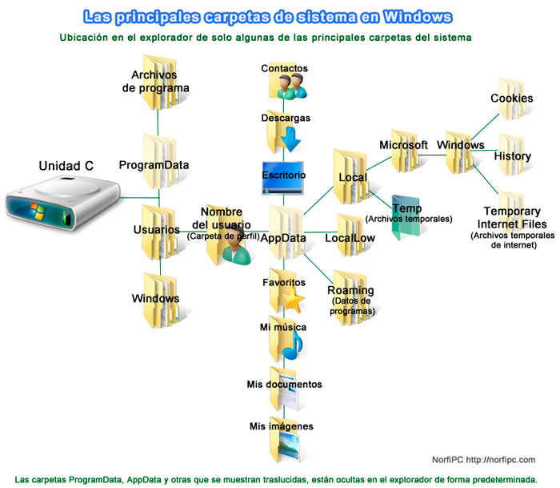

## Sistema de archivos de los sistemas Windows

El sistema de archivos del sistema operativo Windows organiza el contenido de los discos duros en unidades. El disco duro principal es la unidad `C:`. En cada unidad, los archivos se organizan en directorios (carpetas) siguiendo una estructura de árbol cuya raíz es siempre el directorio principal que se representa como la barra invertida `\`. El directorio principal contiene todos los archivos del disco duro.

Por otro lado, cada usuario del sistema tiene asignado un directorio principal de usuario que está dentro del directorio `/Usuarios` y se representa con el carácter `~`. Cualquier usuario puede hacer los cambios que quiera en su directorio de usuario pero no podrá acceder los directorios de otros usuarios ni del resto del sistema de archivos salvo que tenga permiso de administrador del sistema.

## Rutas absolutas y relativas

La ubicación de un archivo o un directorio en la estructura de árbol de la unidad se puede determinar mediante una ruta absoluta o una ruta relativa.

La **ruta absoluta** de un archivo o directorio es la secuencia de directorios que hay que atravesar para llegar al archivo o directorio en cuestión desde el directorio raíz. La ruta se expresa separando los directorios con la barra `\`. 

La **ruta relativa** de un archivo o directorio es la secuencia de directorios que hay que atravesar para llegar al archivo o directorio en cuestión desde el directorio activo. Para referirse al directorio madre se utiliza el alias `..`, mientras que para referirse al propio directorio activo se utiliza el alias `.`.

Mientras que la ruta absoluta de un archivo o directorio es única, la ruta relativa depende del directorio activo.

**Ejemplo**. Supongamos el siguiente árbol de directorios.

La ruta absoluta al directorio `Programación` sería `C:\Usuarios\Alumno\Grado\Primero\Programación`, mientras que la ruta relativa, asumiendo que el directorio activo es `Primero`, es `.\Programación`.
Del mismo modo, la ruta relativa hasta el directorio `Segundo` sería `..\Segundo`.

## La terminal de los sistemas Windows

La terminal de los sistemas Windows proporciona una interfaz de línea de comando (CLI) para acceder a los archivos y dar instrucciones al sistema.

La aplicación `Cmd` viene instalada por defecto en los sistemas Windows y puede ejecutarse como cualquier otra aplicación desde el menú de inicio. Cuando se ejecuta abre una ventana de texto que muestra un mensaje de bienvenida y el `prompt`, que es una cadena de texto con la ruta del directorio actual (inicialmente el directorio principal del usuario `~`) terminada con el carácter `>`. A partir de aquí el usuario puede dar ordenes al sistema tecleando comandos. 

El programa encargado de interpretar los comandos que el usuario introduce en la terminal se denomina `shell`. La shell de Cmd es muy básica y conviene instalar la shell `PowerShell` que es mucho más potente. La aplicación PowerShell no viene instalada en los sistemas Windows por defecto pero puede instalarse siguiendo las [instrucciones de instalación de PowerShell](https://docs.microsoft.com/es-es/powershell/scripting/install/installing-powershell-on-windows?view=powershell-7.2)

Al igual que para la aplicación Cmd, cuando se ejecuta PowerShell se abre la ventana de la terminal con un mensaje de bienvenida y el `prompt`.

## Comandos básicos de PowerShell

Un comando es una instrucción a ejecutar por el sistema operativo. Los comandos suelen llevar asociados parámetros y argumentos. Los parámetros modifican la manera de realizar la instrucción y van precedidos de un guión `-`, mientras que los argumentos indican sobre qué objeto se realiza la acción de indica la instrucción (un archivo, un directorio, etc.)

|Comando | Acción
|:---|:---|
|`ls` | Muestra un listado con el contenido del directorio actual.|
|`ls -l` | Muestra un listado detallado con el contenido del directorio actual.|
|`ls -la`| Muestra un listado detallado con el contenido del directorio actual, incluyendo os archivos ocultos.
|`ls <dir>` | Muestra un listado del directorio `<dir>`.|
|`cd <dir>` | Cambia al directorio `<dir>` convirtiéndolo en el directorio activo.|
|`mkdir <dir>` | Crea el directorio `<dir>`.|
|`mv <origen> <destino>` | Mueve el archivo o directorio `<origen>` al directorio `<destino>`.|
|`rm <f>` | Elimina el archivo `<f>`. |
|`rmdir <dir>` | Elimina el directorio `<dir>` y todo su contenido.|

## Trucos de la terminal

Para manejar con soltura la terminal conviene utilizar algunos trucos que facilitan su uso. 

- Tabulador. La tecla tabulador (⇥) permite completar la entrada del usuario automáticamente, es decir, el usuario comienza a teclear un comando o ruta de archivo y, sin necesidad de escribirla por completo, cuando se pulsa la tecla tabulador el sistema intenta completarla siempre y cuando no haya más de un comando o ruta que comiencen por esos caracteres.

- Teclas de desplazamiento. Las teclas con las flechas de desplazamiento arriba (↑) y abajo (↓) permiten reutilizar comandos que se han usado previamente en la misma sesión de la terminal. 

- Limpiar la terminal. El comando `cls` limpia la terminal.
