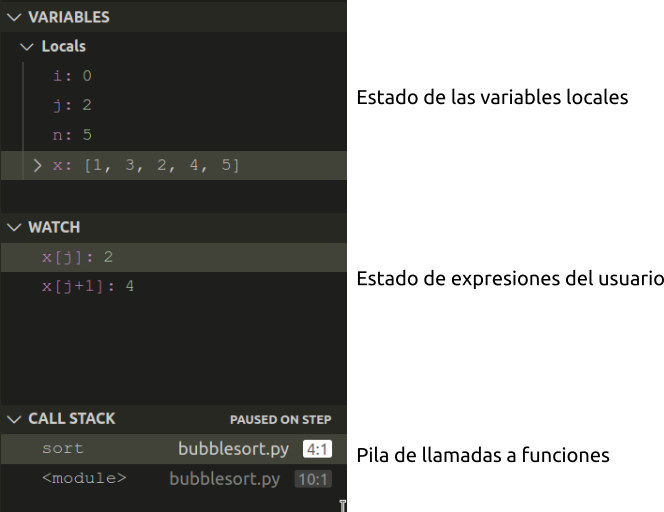

## Depuración de programas

La depuración es una técnica que permite _trazar_ un programa, es decir, seguir el flujo de ejecución de un programa paso a paso, ejecutando una instrucción en cada paso, y observar el estado de sus variables.

Cuando un programa tiene cierta complejidad, la depuración es imprescindible pare detectar posibles errores.

Python dispone del módulo `pyd` para depurar programas, pero es mucho más cómodo utilizar algún entorno de desarrollo que incorpore la depuración, como por ejemplo Visual Studio Code.

### Comandos de depuración

- **Establecer punto de parada**: Detiene la ejecución del programa en una línea concreta de código.
- **Continuar la ejecución**: Continúa la ejecución del programa hasta el siguiente punto de parada o hasta que finalice.
- **Próximo paso**: Ejecuta la siguiente línea de código y para la ejecución.
- **Próximo paso con entrada en función**: Ejecuta la siguiente línea de código. Si se trata de una llamada a una función entonces ejecuta la primera instrucción de la función y para la ejecución.
- **Próximo paso con salida de función**: Ejecuta lo que queda de la función actual y para la ejecución.
- **Terminar la depuración**: Termina la depuración.

### Depuración en Visual Studio Code

Antes de iniciar la depuración de un programa en VSCode hay que establecer algún punto de parada. Para ello basta con hacer click en le margen izquierdo de la ventana con del código a la altura de la línea donde se quiere parar la ejecución del programa.

>

Para iniciar la depuración de un programa en VSCode hay que hacer clic sobre el botón  o pulsar la combinación de teclas (Ctr+Shift+D).

La primera vez que depuremos un programa tendremos que crear un fichero de configuración del depurador (`launch.json`). Para ello hay que hacer clic en el botón `Run and Debug`. VSCode mostrará los distintos ficheros de configuración disponibles y debe seleccionarse el más adecuado para el tipo de programa a depurar. Para programas simples se debe seleccionar `Python file`.

La depuración comenzará iniciando la ejecución del programa desde el inicio hasta el primer punto de parada que encuentre.

Una vez iniciado el proceso de depuración, se puede avanzar en la ejecución del programa haciendo uso de la barra de depuración que contiene botones con los principales comandos de depuración.

Durante la ejecución del programa, se puede ver el contenido de las variables del programa en la ventana del estado de las variables.

El usuario también puede introducir expresiones y ver cómo se evalúan durante la ejecución del programa en la ventana de vista de expresiones.

