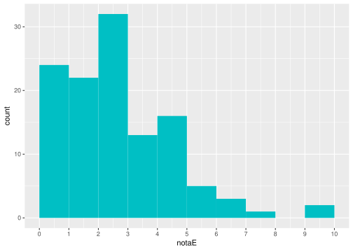
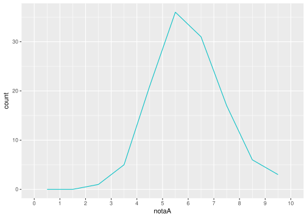
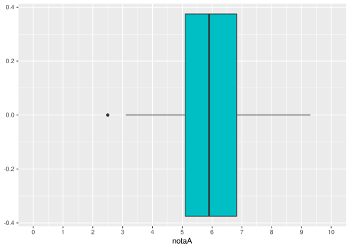
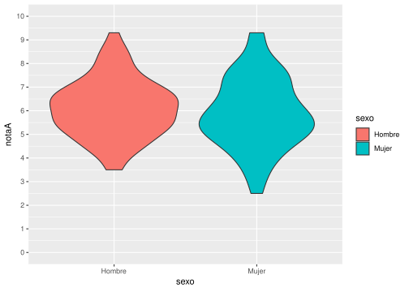
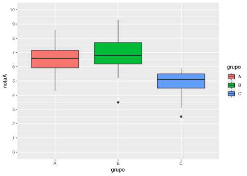

El tipo de estudio estadístico más apropiado en cada caso depende de varios factores:

- El objetivo del estudio.
- El número de variables que intervienen.
- El tipo de las variables dependientes e independientes.
- La naturaleza de las observaciones (independientes o emparejadas).

A continuación se presentan los estudios estadísticos más habituales en función de estos factores. La siguiente tabla puede ayudar a identificar el más apropiado en cada caso.

<table width="1054" cellspacing="0" cellpadding="5" border="1">
<tbody>
<tr>
<td bgcolor="#6d9eeb" width="95">
<p><strong>Variables independientes</strong></p>
</td>
<td bgcolor="#6d9eeb" width="88">
<p><strong>Variable dependiente</strong></p>
</td>
<td bgcolor="#6d9eeb" width="315">
<p><strong>Objetivo</strong></p>
</td>
<td bgcolor="#6d9eeb" width="330">
<p><strong>Ejemplo</strong></p>
</td>
<td bgcolor="#6d9eeb" width="174">
<p><strong>Contraste</strong></p>
</td>
</tr>
<tr>
<td rowspan="6" width="95" height="14">
<p>Ninguna<br /> (Una poblaci&oacute;n)</p>
</td>
<td rowspan="2" width="88">
<p>Cuantitativa</p>
</td>
<td rowspan="2" width="315">
<p>Contrastar la normalidad de una variable</p>
</td>
<td rowspan="2" width="330">
<p>Comprobar si la nota de un examen tiene distribuci&oacute;n normal (forma de campana de Gauss)</p>
</td>
<td width="174">
<p>Komogorov-Smirnov<br /> (requiere muestras grandes)</p>
</td>
</tr>
<tr>
<td width="174">
<p>Shapiro-Willks</p>
</td>
</tr>
<tr>
<td width="88">
<p>Cuantitativa normal</p>
</td>
<td width="315">
<p>Contrastar si la media poblacional de una variable tiene un valor determinado</p>
</td>
<td width="330">
<p>Comprobar si la nota media de un examen es 5</p>
</td>
<td width="174">
<p>Test T para la media de una poblaci&oacute;n</p>
</td>
</tr>
<tr>
<td width="88">
<p>Cuantitativa o cualitativa ordinal</p>
</td>
<td width="315">
<p>Contrastar si la mediana poblacional de una variable tiene un valor determinado</p>
</td>
<td width="330">
<p>Comprobar si la calificaci&oacute;n mediana de un examen es Aprobado</p>
</td>
<td width="174">
<p>Test para la mediana de una poblaci&oacute;n</p>
</td>
</tr>
<tr>
<td width="88">
<p>Cualitativa (2 categor&iacute;as)</p>
</td>
<td width="315">
<p>Contrastar si la proporci&oacute;n poblacional de una de las categor&iacute;as tiene un valor determinado</p>
</td>
<td width="330">
<p>Comprobar si la proporci&oacute;n de aprobados es de la mitad (o que el porcentaje es 50%)</p>
</td>
<td width="174">
<p>Test Binomial</p>
</td>
</tr>
<tr>
<td width="88">
<p>Cualitativa</p>
</td>
<td width="315">
<p>Contrastar si las proporciones de cada una de las categor&iacute;as tienen un valor determinado</p>
</td>
<td width="330">
<p>Comprobar si las proporciones de alumnos matriculados en ciencias, letras o mixtas son 0.5, 0.2 y 0.3 respectivamente</p>
</td>
<td width="174">
<p>Test Chi-cuadrado de bondad de ajuste</p>
</td>
</tr>
<tr>
<td rowspan="7" width="95" height="13">
<p>Una cualitativa con dos categor&iacute;as independientes <br /> (Dos poblaciones independientes)</p>
</td>
<td rowspan="3" width="88">
<p>Cuantitativa normal</p>
</td>
<td width="315">
<p>Contrastar si hay diferencias entre las medias la variable dependiente en dos poblaciones independientes</p>
</td>
<td width="330">
<p>Comprobar si el grupo de ma&ntilde;ana y el grupo de tarde han tenido notas medias diferentes</p>
</td>
<td width="174">
<p>Test T para la comparaci&oacute;n de medias de poblaciones independientes</p>
</td>
</tr>
<tr>
<td width="315">
<p>Contrastar si hay diferencias entre las varianzas de la variable dependiente en dos poblaciones independientes</p>
</td>
<td width="330">
<p>Comprobar si hay diferencias entre la variabilidad de las notas del grupo de ma&ntilde;ana y el de tarde</p>
</td>
<td width="174">
<p>Test F de Fisher</p>
</td>
</tr>
<tr>
<td width="315">
<p>Contrastar si hay concordancia o acuerdo entre las dos variables</p>
</td>
<td width="330">
<p>Comprobar si hay concordancia o acuerdo entre las notas que ponen dos profesores distintos para los mismos ex&aacute;menes</p>
</td>
<td width="174">
<p>Correlaci&oacute;n intraclase</p>
</td>
</tr>
<tr>
<td rowspan="2" width="88">
<p>Cuantitativa o cualitativa ordinal</p>
</td>
<td width="315">
<p>Contrastar si hay diferencias entre las distribuciones de la variable dependiente en dos poblaciones independientes</p>
</td>
<td width="330">
<p>Comprobar si el grupo de ma&ntilde;ana y el grupo de tarde han tenido calificaciones diferentes</p>
</td>
<td width="174">
<p>Test de la U de Mann-Whitney</p>
</td>
</tr>
<tr>
<td width="315">
<p>Contrastar si hay concordancia o acuerdo entre las dos variables</p>
</td>
<td width="330">
<p>Comprobar si hay concordancia o acuerdo entre las calificaciones que ponen dos profesores distintos para los mismos ex&aacute;menes</p>
</td>
<td width="174">
<p>Kappa de Cohen</p>
</td>
</tr>
<tr>
<td rowspan="2" width="88">
<p>Cualitativa</p>
</td>
<td width="315">
<p>Contrastar si hay relaci&oacute;n entre las dos variables o bien si hay diferencias entre las proporciones de las categor&iacute;as de la variable dependiente en las dos poblaciones definidas por las categor&iacute;as de la variable independiente</p>
</td>
<td width="330">
<p>Comprobar si existe relaci&oacute;n entre los aprobados en una asignatura y el grupo al que pertenecen los alumnos, es decir, si la proporci&oacute;n de aprobados es diferente en dos grupos distintos.</p>
</td>
<td width="174">
<p>Test Chi-cuadrado <br /> (si no ha m&aacute;s del 20% de frecuencias esperadas menores que 5)<br /> Test exacto de Fisher</p>
</td>
</tr>
<tr>
<td width="315">
<p>Contrastar si hay concordancia o acuerdo entre las dos variables</p>
</td>
<td width="330">
<p>Comprobar si hay concordancia o acuerdo entre la valoraci&oacute;n (aprobado o suspenso) que hacen dos profesores distintos para los mismos ex&aacute;menes</p>
</td>
<td width="174">
<p>Kappa de Cohen</p>
</td>
</tr>
<tr>
<td rowspan="3" width="95" height="14">
<p>Una cualitativa con dos categor&iacute;as relacionadas o pareadas<br /> (Dos poblaciones relacionadas o pareadas)</p>
</td>
<td width="88">
<p>Cuantitativa normal</p>
</td>
<td width="315">
<p>Contrastar si hay diferencias entre las medias de la variable dependiente en dos poblaciones relacionadas o pareadas</p>
</td>
<td width="330">
<p>Comprobar si las notas medias de dos asignaturas cursadas por los mismos alumnos han sido diferentes o si las notas medias de un examen realizado al comienzo del curso (antes) y otro al final (despu&eacute;s) de una misma asignatura han sido diferentes</p>
</td>
<td width="174">
<p>Test T para la comparaci&oacute;n de medias de poblaciones relacionadas o pareadas</p>
</td>
</tr>
<tr>
<td width="88">
<p>Cuantitativa o cualitativa ordinal</p>
</td>
<td width="315">
<p>Contrastar si hay diferencias entre las distribuciones de la variable dependiente en dos poblaciones relacionadas o pareadas</p>
</td>
<td width="330">
<p>Comprobar si las calificaciones de dos asignaturas cursadas por los mismos alumnos han sido diferentes</p>
</td>
<td width="174">
<p>Test de Wilcoxon</p>
</td>
</tr>
<tr>
<td width="88">
<p>Cualitativa con dos categor&iacute;as</p>
</td>
<td width="315">
<p>Contrastar si hay diferencias entre las proporciones de las categor&iacute;as de la variable dependiente en dos poblaciones relacionadas o pareadas</p>
</td>
<td width="330">
<p>Comprobar si la proporci&oacute;n o el porcentaje de aprobados en un examen es distinta al comienzo y al final del curso</p>
</td>
<td width="174">
<p>Test de McNemar</p>
</td>
</tr>
<tr>
<td rowspan="4" width="95" height="14">
<p>Una cualitativa con dos o m&aacute;s categor&iacute;as</p>
<p>independientes<br /> (Dos o m&aacute;s poblaciones independientes)</p>
</td>
<td width="88">
<p>Cuantitativa normal y homogeneidad de varianzas</p>
</td>
<td width="315">
<p>Contrastar si hay diferencias entre las medias la variable dependiente en cada una de las poblaciones definidas por las categor&iacute;as de la variable independiente</p>
</td>
<td width="330">
<p>Comprobar si existen diferencias entre las notas medias de tres grupos distintos de clase.</p>
</td>
<td width="174">
<p>An&aacute;lisis de la Varianza de un factor (ANOVA)<br /> Si hay diferencias &gt; Test de Tukey o Bonferroni para la diferencia por pares</p>
</td>
</tr>
<tr>
<td width="88">
<p>Cuantitativa normal</p>
</td>
<td width="315">
<p>Contrastar si hay diferencias entre las varianzas de la variable dependiente en cada una de las poblaciones definidas por las categor&iacute;as de la variable independiente</p>
</td>
<td width="330">
<p>Comprobar si la variabilidad de las notas de una asignatura es distinta en tres grupos diferentes de clase</p>
</td>
<td width="174">
<p>Prueba de Levene para la homogeneidad de varianzas</p>
</td>
</tr>
<tr>
<td width="88">
<p>Cuantitativa o cualitativa ordinal</p>
</td>
<td width="315">
<p>Contrastar si hay diferencias entre las distribuciones de la variable dependiente en cada una de las poblaciones definidas por las categor&iacute;as de la variable independiente</p>
</td>
<td width="330">
<p>Comprobar si existen diferencias entre las calificaciones de tres grupos distintos de clase</p>
</td>
<td width="174">
<p>Test de Kruskal Wallis</p>
</td>
</tr>
<tr>
<td width="88">
<p>Cualitativa</p>
</td>
<td width="315">
<p>Contrastar si hay relaci&oacute;n entre las dos variables o bien si hay diferencias entre las proporciones de las categor&iacute;as de la variable dependiente en cada una de las poblaciones definidas por las categor&iacute;as de la variable independiente</p>
</td>
<td width="330">
<p>Comprobar si existe relaci&oacute;n entre los aprobados en una asignatura y el grupo al que pertenecen los alumnos, es decir, si la proporci&oacute;n de aprobados es diferente en los distintos grupos.</p>
</td>
<td width="174">
<p>Test Chi-cuadrado <br /> (si no ha m&aacute;s del 20% de frecuencias esperadas menores que 5)<br /> Test exacto de Fisher</p>
</td>
</tr>
<tr>
<td rowspan="3" width="95" height="14">
<p>Una cualitativa con dos o m&aacute;s categor&iacute;as relacionadas <br /> (medidas repetidas)</p>
</td>
<td width="88">
<p>Cuantitativa normal</p>
</td>
<td width="315">
<p>Contrastar si hay diferencias entre las medias repetidas de la variable dependiente</p>
</td>
<td width="330">
<p>Comprobar si hay diferencias entre las notas que otorgan varios profesores a un mismo examen</p>
</td>
<td width="174">
<p>An&aacute;lisis de la Varianza (ANOVA) de medidas repetidas de un factor</p>
</td>
</tr>
<tr>
<td width="88">
<p>Cuantitativa o cualitativa ordinal</p>
</td>
<td width="315">
<p>Contrastar si hay diferencias entre las medidas repetidas de la variable dependiente</p>
</td>
<td width="330">
<p>Comprobar si hay diferencias entre las calificaciones que otorgan varios profesores a un mismo examen</p>
</td>
<td width="174">
<p>Test de Friedman</p>
</td>
</tr>
<tr>
<td width="88">
<p>Cualitativa</p>
</td>
<td width="315">
<p>Contrastar si hay diferencias entre las valoraciones repetidas de la variable dependiente</p>
</td>
<td width="330">
<p>Comprobar si hay diferencias entre la valoraci&oacute;n (aprobado o suspenso) que hacen varios profesores de un mismo examen</p>
</td>
<td width="174">
<p>Regresi&oacute;n log&iacute;stica de medidas repetidas</p>
</td>
</tr>
<tr>
<td rowspan="4" width="95" height="13">
<p>Una cuantitativa normal</p>
</td>
<td rowspan="2" width="88">
<p>Cuantitativa normal</p>
</td>
<td width="315">
<p>Contrastar si existe relaci&oacute;n lineal entre las dos variables</p>
</td>
<td width="330">
<p>Comprobar si existe relaci&oacute;n entre las notas de dos asignaturas</p>
</td>
<td width="174">
<p>Correlaci&oacute;n de Pearson</p>
</td>
</tr>
<tr>
<td width="315">
<p>Construir un modelo predictivo que explique la variable dependiente en funci&oacute;n de la independiente</p>
</td>
<td width="330">
<p>Construir el modelo (funci&oacute;n de regresi&oacute;n) que mejor explique la relaci&oacute;n entre la nota de un examen y las horas dedicadas a su estudio</p>
</td>
<td width="174">
<p>Regresi&oacute;n simple (lineal o no lineal)</p>
</td>
</tr>
<tr>
<td width="88">
<p>Cuantitativa o cualitativa ordinal</p>
</td>
<td width="315">
<p>Contrastar si existe relaci&oacute;n lineal entre las dos variables</p>
</td>
<td width="330">
<p>Comprobar si existe relaci&oacute;n entre las calificaciones de dos asignaturas</p>
</td>
<td width="174">
<p>Correlaci&oacute;n de Spearman</p>
</td>
</tr>
<tr>
<td width="88">
<p>Cualitativa</p>
</td>
<td width="315">
<p>Construir un modelo predictivo que explique la variable dependiente en funci&oacute;n de la independiente</p>
</td>
<td width="330">
<p>Construir el modelo (funci&oacute;n log&iacute;stica) que mejor explique la relaci&oacute;n entre el resultado de un examen (aprobado o suspenso) y las horas dedicadas a su estudio</p>
</td>
<td width="174">
<p>Regresi&oacute;n log&iacute;stica simple</p>
</td>
</tr>
</tbody>
</table>

Los ejemplos de los distintos test que se presentan a continuación se han realizado a partir del siguiente conjunto de datos que contiene las notas y calificaciones de un curso. El fichero con los datos puede descargarse aquí para reproducir los estudios: [datos-curso.csv](datos/datos-curso.csv)

``` r
library(tidyverse)
```

## Una variable cuantitativa

### Estudios descriptivos

#### Estadísticos

-   Tamaño muestral
-   Media
-   Desviación típica
-   Mínimo, Máximo
-   Cuartiles
-   Coeficiente de asimetría
-   Coeficiente de apuntamiento

``` r
# Tamaño muestral
nrow(df)
```

    ## [1] 120

``` r
# Media
mean(df$notaA, na.rm = TRUE)
```

    ## [1] 6.028333

``` r
# Desviación típica
sd(df$notaA, na.rm = TRUE)
```

    ## [1] 1.340524

``` r
# Min, max
min(df$notaA, na.rm = TRUE)
```

    ## [1] 2.5

``` r
max(df$notaA, na.rm = TRUE)
```

    ## [1] 9.3

``` r
# Cuartiles
quantile(df$notaA, c(0.25, 0.5, 0.75), na.rm = TRUE)
```

    ##   25%   50%   75% 
    ## 5.100 5.900 6.825

``` r
# Coef. asimetría
library(moments)
skewness(df$notaA, na.rm = TRUE)
```

    ## [1] 0.1373915

``` r
# Coef. apuntamiento
kurtosis(df$notaA, na.rm = TRUE) - 3
```

    ## [1] -0.102287

#### Gráficos

-   Diagrama de barras (variables discretas)

``` r
df %>% ggplot(aes(x = asinaturas.aprobadas)) + 
  geom_bar(fill="#00BFC4") + 
  # Cambio de escala del eje X
  scale_x_discrete(limits=0:5) 
```

<!-- -->

-   Histograma

``` r
library(ggplot2)
# Límites de los intervalos
breaks = 0:10
# Histograma de las notasA
df %>% ggplot(aes(x = notaA)) + 
  geom_histogram(breaks = breaks, fill="#00BFC4") + 
  # Cambio de escala del eje X
  scale_x_continuous(limits=c(0, 10), breaks = 0:10) 
```

<!-- -->

``` r
# Histograma de notasE
df %>% ggplot(aes(x = notaE)) + 
  geom_histogram(breaks = breaks, fill="#00BFC4") + 
  # Cambio de escala del eje X
  scale_x_continuous(limits=c(0, 10), breaks = 0:10) 
```

<!-- -->

-   Diagrama de líneas

``` r
# Variables discretas
df %>% count(asinaturas.aprobadas) %>%
  ggplot(aes(x = asinaturas.aprobadas, y = n)) +
  geom_line(col="#00BFC4") + 
  # Cambio de escala del eje X
  scale_x_discrete(limits=0:5) 
```

<!-- -->

``` r
# Agrupación de datos en intervalos
df %>% ggplot(aes(x = notaA)) + 
  geom_freqpoly(breaks = breaks, col="#00BFC4") + 
  # Cambio de escala del eje X
  scale_x_continuous(limits=c(0, 10), breaks = 0:10) 
```

<!-- -->

-   Diagrama de caja y bigotes

``` r
df %>% ggplot(aes(x = notaA)) + 
  geom_boxplot(fill="#00BFC4") +
  # Cambio de escala del eje X
  scale_x_continuous(limits=c(0, 10), breaks = 0:10)
```

<!-- -->

### Estudios inferenciales

#### Test de normalidad de Shapiro-Wilk

**Objetivo**: Comprobar la normalidad de la distribución.

**Hipótesis nula**: La distribución es normal.

``` r
shapiro.test(df$notaA)
```

    ## 
    ##  Shapiro-Wilk normality test
    ## 
    ## data:  df$notaA
    ## W = 0.99424, p-value = 0.907

``` r
shapiro.test(df$notaE)
```

    ## 
    ##  Shapiro-Wilk normality test
    ## 
    ## data:  df$notaE
    ## W = 0.92264, p-value = 4.065e-06

#### Test t para la media de una población

**Objetivo**: Estimar la media de una variable o compararla con un valor
dado *μ*<sub>0</sub>.

**Requisitos**:

-   Una variable cuantitativa.
-   Distribución normal o tamaño muestral ≥ 30.

**Hipótesis nula**: La media de la población es igual a *μ*<sub>0</sub>.

**Ejemplo**: Comprobar si la nota media de un examen es diferente de 5.

``` r
t.test(df$notaA, mu = 5, alternative = "two.sided")
```

    ## 
    ##  One Sample t-test
    ## 
    ## data:  df$notaA
    ## t = 8.4033, df = 119, p-value = 1.08e-13
    ## alternative hypothesis: true mean is not equal to 5
    ## 95 percent confidence interval:
    ##  5.786023 6.270643
    ## sample estimates:
    ## mean of x 
    ##  6.028333

## Una variable cualitativa

### Estudios descriptivos

#### Estadísticos

-   Tamaños muestral
-   Frecuencias muestrales
-   Proporciones/porcentajes muestrales

``` r
# Tamaño muestral sin datos perdidos
length(na.omit(df$calificacionB))
```

    ## [1] 115

``` r
# Frecuencias
table(df$calificacionB)
```

    ## 
    ## Aprobado Suspenso 
    ##       98       17

``` r
# Proporciones
table(df$calificacionB) / length(na.omit(df$calificacionB))
```

    ## 
    ##  Aprobado  Suspenso 
    ## 0.8521739 0.1478261

``` r
# Porcentajes
table(df$calificacionB) / length(na.omit(df$calificacionB)) * 100
```

    ## 
    ## Aprobado Suspenso 
    ## 85.21739 14.78261

#### Gráficos

-   Diagrama de sectores

``` r
df %>% ggplot(aes(x = "", fill = calificacionA)) + 
  geom_bar() +
  # Cambiar a coordenadas polares
  coord_polar(theta = "y") +
  # Eliminar ejes
   theme_void()
```

<!-- -->

### Estudios inferenciales

#### Test binomial para una proporción de una población

**Objetivo**: Estimar la propoción de una categoría en una población o
compararla con un valor *p*<sub>0</sub>.

**Requisitos**:

-   One variable cualitativa

**Hipótesis nula**: La proporción poblacional es igual a
*p*<sub>0</sub>.

**Ejemplo**: Comprobar si la proporción de aprobados es mayor de 0.5.

``` r
freq <- table(df$calificacionA)["Aprobado"]
binom.test(freq, n, p = 0.7, alternative = "greater")
```

    ## 
    ##  Exact binomial test
    ## 
    ## data:  freq and n
    ## number of successes = 94, number of trials = 120, p-value = 0.02657
    ## alternative hypothesis: true probability of success is greater than 0.7
    ## 95 percent confidence interval:
    ##  0.7123183 1.0000000
    ## sample estimates:
    ## probability of success 
    ##              0.7833333

#### Test Z para la proporción de una población

**Objetivo**: Estimar la propoción de una categoría en una población o
compararla con un valor *p*<sub>0</sub>.

**Requisitos**:

-   Una variable cualitativa
-   Tamaño muestral >= 30

**Observación**: Utiliza la aproximación normal de la distribución
Binomal.

**Ejemplo**: Comprobar si la proporción de aprobados es mayor de 0.5.

``` r
freq <- table(df$calificacionA)["Aprobado"]
prop.test(freq, n, p = 0.7, alternative = "greater")
```

    ## 
    ##  1-sample proportions test with continuity correction
    ## 
    ## data:  freq out of n, null probability 0.7
    ## X-squared = 3.5813, df = 1, p-value = 0.02922
    ## alternative hypothesis: true p is greater than 0.7
    ## 95 percent confidence interval:
    ##  0.7111099 1.0000000
    ## sample estimates:
    ##         p 
    ## 0.7833333

## Dos variables: Variable dependiente cuantitativa y variable independiente culitativa con dos categorías o grupos

### Estudios descriptivos

#### Estadísticos

-   Tamaño muestral de cada grupo
-   Media de cada grupo
-   Desviación típica de cada grupo
-   Mínimo, Máximo de cada grupo
-   Cuartiles de cada grupo
-   Coeficiente de asimetría de cada grupo
-   Coeficiente de apuntamiento de cada grupo

``` r
# Tamaño muestral de notaA según el sexo
df %>% group_by(sexo) %>% group_size()
```

    ## [1] 71 49

``` r
# Media, Desviación típica, Mín, Máx, Cuartiles, Coef. Asimetría y Coef. Apuntamiento
library(moments)
df %>% group_by(sexo) %>% summarize(Media = mean(notaA, na.rm=TRUE), Des.Tip = sd(notaA, na.rm = TRUE), Mín = min(notaA), Máx = max(notaA), C1 = quantile(notaA, 0.25, na.rm = TRUE), C2 = quantile(notaA, 0.5, na.rm = TRUE), C3 = quantile(notaA, 0.75, na.rm = TRUE), Coef.Asimetría = skewness(notaA, na.rm = TRUE), Coef.Apuntamiento = kurtosis(notaA, na.rm = TRUE) - 3)
```

    ## # A tibble: 2 x 10
    ##   sexo   Media Des.Tip   Mín   Máx    C1    C2    C3 Coef.Asimetría
    ##   <chr>  <dbl>   <dbl> <dbl> <dbl> <dbl> <dbl> <dbl>          <dbl>
    ## 1 Hombre  6.12    1.23   3.5   9.3   5.3   6.1  6.85          0.249
    ## 2 Mujer   5.89    1.49   2.5   9.3   5     5.7  6.8           0.135
    ## # … with 1 more variable: Coef.Apuntamiento <dbl>

#### Gráficos

-   Diagrama de cajas y bigotes

``` r
df %>% ggplot(aes(x = sexo, y = notaA, fill = sexo)) + 
  geom_boxplot() +
  # Cambio de escala del eje X
  scale_y_continuous(limits=c(0, 10), breaks = 0:10)
```

<!-- -->

-   Diagrama de violín

``` r
df %>% ggplot(aes(x = sexo, y = notaA, fill = sexo)) + 
  geom_violin() +
  # Cambio de escala del eje X
  scale_y_continuous(limits=c(0, 10), breaks = 0:10)
```

<!-- -->

### Estudios inferenciales

#### Test de normalidad de Shapiro-Wilks

**Objetivo**: Comprobar la normalidad de la distribución de cada
población.

**Hipótesis nula**: La distribución es normal.

``` r
df %>% group_by(sexo) %>% 
  summarise(`Estadístico W` = shapiro.test(notaA)$statistic, `p-valor` = shapiro.test(notaA)$p.value)
```

    ## # A tibble: 2 x 3
    ##   sexo   `Estadístico W` `p-valor`
    ##   <chr>            <dbl>     <dbl>
    ## 1 Hombre           0.990     0.872
    ## 2 Mujer            0.990     0.942

#### Test F de Fisher de comparación de varianzas de dos poblaciones independientes

**Objetivo**: Comparar las varianzas de dos poblaciones independientes.

**Requisitos**:

-   Variable dependiente cuantitativa.
-   Una variable independiente cualitativa con dos categorías
    (poblaciones)
-   Distribución normal de la variable dependiente en ambas poblaciones
    o tamaños de las muestras de cada población ≥ 30.

**Hipótesis nula**: La varianzas poblacionales son iguales (no existe
una diferencia significativa entre las medias poblacionales).

**Ejemplo**: Comprobar si diferencias signicativas entre las notas
medias de hombres y mujeres.

``` r
# Test de comparación de varianzas
var.test(notaA ~ sexo, data = df)
```

    ## 
    ##  F test to compare two variances
    ## 
    ## data:  notaA by sexo
    ## F = 0.6769, num df = 70, denom df = 48, p-value = 0.1347
    ## alternative hypothesis: true ratio of variances is not equal to 1
    ## 95 percent confidence interval:
    ##  0.3953421 1.1293155
    ## sample estimates:
    ## ratio of variances 
    ##          0.6769032

#### Test t de comparación de medias de dos poblaciones independientes

**Objetivo**: Estimar la diferencia de medias en las dos poblaciones o
comprobar si hay diferencias significativas entre ellas.

**Requisitos**:

-   Variable dependiente cuantitativa.
-   Una variable independiente cualitativa con dos categorías
    (poblaciones)
-   Distribución normal de la variable dependiente en ambas poblaciones
    o tamaños de las muestras de cada población ≥ 30.

**Hipótesis nula**: La medias poblacionales son iguales (no existe una
diferencia significativa entre las medias poblacionales).

**Observación**: El resultado del test depende de si las varianzas
poblacionales son iguales o no.

**Ejemplo**: Comprobar si diferencias signicativas entre las notas
medias de hombres y mujeres.

``` r
# Test de comparación de varianzas
var.test(notaA ~ sexo, data = df)
```

    ## 
    ##  F test to compare two variances
    ## 
    ## data:  notaA by sexo
    ## F = 0.6769, num df = 70, denom df = 48, p-value = 0.1347
    ## alternative hypothesis: true ratio of variances is not equal to 1
    ## 95 percent confidence interval:
    ##  0.3953421 1.1293155
    ## sample estimates:
    ## ratio of variances 
    ##          0.6769032

``` r
# Test de comparación de medias asumiendo varianzas iguales
t.test (notaA ~ sexo, data = df, alternative = "two.sided", var.equal = FALSE)
```

    ## 
    ##  Welch Two Sample t-test
    ## 
    ## data:  notaA by sexo
    ## t = 0.89364, df = 89.873, p-value = 0.3739
    ## alternative hypothesis: true difference in means between group Hombre and group Mujer is not equal to 0
    ## 95 percent confidence interval:
    ##  -0.2821809  0.7435779
    ## sample estimates:
    ## mean in group Hombre  mean in group Mujer 
    ##             6.122535             5.891837

``` r
# Test de comparación de medias asumiendo varianzas iguales
t.test (notaA ~ sexo, data = df, alternative = "two.sided", var.equal = TRUE)
```

    ## 
    ##  Two Sample t-test
    ## 
    ## data:  notaA by sexo
    ## t = 0.92608, df = 118, p-value = 0.3563
    ## alternative hypothesis: true difference in means between group Hombre and group Mujer is not equal to 0
    ## 95 percent confidence interval:
    ##  -0.262615  0.724012
    ## sample estimates:
    ## mean in group Hombre  mean in group Mujer 
    ##             6.122535             5.891837

-   Diagrama de medias

``` r
df %>% ggplot(aes(x = sexo, y = notaA, colour = sexo)) + 
  # Puntos de medias
  stat_summary(fun="mean", size=3,  geom="point", position=position_dodge(width=0.25)) + 
  # Intervalos de confianza para la media
  stat_summary(fun.data = function(x) mean_cl_normal(x, conf.int=0.95), geom = "pointrange", position=position_dodge(width=0.25)) 
```

<!-- -->

#### Test U de Mann-Whitney de comparación de dos poblaciones independientes (no paramétrico)

**Objetivo**: Comprobar si hay diferencias significativas entre entre
dos poblaciones independientes.

**Requisitos**:

-   Variable dependiente cuantitativa.
-   Una variable independiente cualitativa con dos categorías
    (poblaciones)

**Hipótesis nula**: La medianas poblacionales son iguales (no existe una
diferencia significativa entre las medianas poblacionales).

**Ejemplo**: Comprobar si diferencias signicativas entre las notas de
hombres y mujeres.

``` r
# Test de rangos U the Mann-Whitney
wilcox.test(notaA ~ sexo, data = df, alternative = "two.sided")
```

    ## 
    ##  Wilcoxon rank sum test with continuity correction
    ## 
    ## data:  notaA by sexo
    ## W = 1917, p-value = 0.3445
    ## alternative hypothesis: true location shift is not equal to 0

## Dos variables: Variable dependiente cuantitativa y variable independiente culitativa con dos categorías o grupos pareados

Dos grupos o poblaciones están pareadas o emparejadas cuando los dos
poblaciones contienen los mismos individuos, es decir, se trata en
realidadad de una única población, pero la variable dependiente se mide
dos veces en cada individuo (normalmente antes y después de la algún
suceso) y por tanto cada individuo tiene asociado un par de valores.

Este estudio puede realizarse también creando una nueva variable a
partir de la resta de las dos mediciones y planteando un estudio de una
sola variable cuantitativa.

**Ejemplo**: Creación de la diferencia de notas de las asignaturas A y
B.

``` r
# Creamos la variable diferencia = notaA - notaB
df <- df %>% mutate(diferencia = notaA - notaB)
```

### Estudios descriptivos

#### Estadísticos

-   Tamaño muestral del grupo
-   Media de la diferencia
-   Desviación típica de la diferencia
-   Mínimo, Máximo de la diferencia
-   Cuartiles de la diferencia
-   Coeficiente de asimetría de la diferencia
-   Coeficiente de apuntamiento de la diferencia

**Ejemplo**: Estadísticos descriptivos de la diferencia entre las notas
de las asignaturas A y B de un mismo grupo de alumnos.

``` r
# Tamaño muestral de sin contar los datos perdidos
length(na.omit(df$diferencia))
```

    ## [1] 115

``` r
# Media, Desviación típica, Mín, Máx, Cuartiles, Coef. Asimetría y Coef. Apuntamiento
library(moments)
df %>% summarize(Media = mean(diferencia, na.rm=TRUE), Des.Tip = sd(diferencia, na.rm = TRUE), Mín = min(diferencia, na.rm = TRUE), Máx = max(diferencia, na.rm = TRUE), C1 = quantile(diferencia, 0.25, na.rm = TRUE), C2 = quantile(diferencia, 0.5, na.rm = TRUE), C3 = quantile(diferencia, 0.75, na.rm = TRUE), Coef.Asimetría = skewness(diferencia, na.rm = TRUE), Coef.Apuntamiento = kurtosis(diferencia, na.rm = TRUE) - 3)
```

    ## # A tibble: 1 x 9
    ##    Media Des.Tip   Mín   Máx    C1    C2     C3 Coef.Asimetría Coef.Apuntamiento
    ##    <dbl>   <dbl> <dbl> <dbl> <dbl> <dbl>  <dbl>          <dbl>             <dbl>
    ## 1 -0.882   0.900  -3.2  1.10  -1.5  -0.8 -0.300         -0.430            -0.137

#### Gráficos

-   Diagrama de cajas y bigotes

``` r
df %>% ggplot(aes(x = diferencia)) + 
  geom_boxplot(fill="#00BFC4")
```

<!-- -->

### Estudios inferenciales

#### Test de normalidad de Shapiro-Wilks

**Objetivo**: Comprobar la normalidad de la distribución de la
diferencia.

**Hipótesis nula**: La distribución es normal.

**Ejemplo**: Comprobar la normalidad de la diferencia entre las notas de
las asignaturas A y B de un mismo grupo de alumnos.

``` r
df %>% summarise(`Estadístico W` = shapiro.test(diferencia)$statistic, `p-valor` = shapiro.test(diferencia)$p.value)
```

    ## # A tibble: 1 x 2
    ##   `Estadístico W` `p-valor`
    ##             <dbl>     <dbl>
    ## 1           0.979    0.0737

#### Test t de comparación de medias de dos poblaciones pareadas

**Objetivo**: Estimar la media de la diferencia o compararla con un
valor dado *μ*<sub>0</sub>.

**Requisitos**:

-   Variable dependiente cuantitativa.
-   Una variable independiente cualitativa con dos categorías
    (poblaciones) pareadas
-   Distribución normal de la variable diferencia o tamaño muestral
    ≥ 30.

**Hipótesis nula**: La medias poblacionales son iguales (no existe una
diferencia significativa entre las medias poblacionales).

**Ejemplo**: Comprobar si hay una diferencia signicativa entre las notas
medias de las asinaturas A y B, o lo que es lo mismo, comprobar si la
media de la diferencia de las notas de A y B es distinta de 0.

``` r
t.test (notaA, notaB, data = df, alternative = "two.sided", paired = TRUE)
```

    ## 
    ##  Paired t-test
    ## 
    ## data:  notaA and notaB
    ## t = -10.618, df = 114, p-value < 2.2e-16
    ## alternative hypothesis: true difference in means is not equal to 0
    ## 95 percent confidence interval:
    ##  -1.0515337 -0.7208695
    ## sample estimates:
    ## mean of the differences 
    ##              -0.8862016

-   Diagrama de medias

``` r
df %>% ggplot(aes(x="", y = diferencia)) + 
  # Puntos de medias
  stat_summary(fun="mean", size=3,  geom="point") + 
  # Intervalos de confianza para la media
  stat_summary(fun.data = function(x) mean_cl_normal(x, conf.int=0.95), geom = "pointrange", position=position_dodge(width=0.25)) 
```

<!-- -->

#### Test Wilcoxon de comparación de dos poblaciones pareadas (no paramétrico)

**Objetivo**: Comparar las medianas de las dos poblaciones.

**Requisitos**:

-   Variable dependiente cuantitativa.
-   Una variable independiente cualitativa con dos categorías
    (poblaciones) pareadas.

**Hipótesis nula**: La medianas poblacionales son iguales (no existe una
diferencia significativa entre las medianas poblacionales).

**Ejemplo**: Comprobar si hay una diferencia signicativa entre las notas
de las asignaturas A y B.

``` r
wilcox.test(notaA, notaB, data = df, alternative = "two.sided", paired = TRUE)
```

    ## 
    ##  Wilcoxon signed rank test with continuity correction
    ## 
    ## data:  notaA and notaB
    ## V = 466, p-value = 1.192e-15
    ## alternative hypothesis: true location shift is not equal to 0

## Dos variables: Variable dependiente cuantitativa y variable independiente culitativa con más de dos categorías o grupos

### Estudios descriptivos

#### Estadísticos

-   Tamaño muestral de cada grupo
-   Media de cada grupo
-   Desviación típica de cada grupo
-   Mínimo, Máximo de cada grupo
-   Cuartiles de cada grupo
-   Coeficiente de asimetría de cada grupo
-   Coeficiente de apuntamiento de cada grupo

``` r
# Tamaño muestral de notaA según el grupo
df %>% group_by(grupo) %>% group_size()
```

    ## [1] 38 35 47

``` r
# Media, Desviación típica, Mín, Máx, Cuartiles, Coef. Asimetría y Coef. Apuntamiento
library(moments)
df %>% group_by(grupo) %>% summarize(Media = mean(notaA, na.rm=TRUE), Des.Tip = sd(notaA, na.rm = TRUE), Mín = min(notaA, na.rm = TRUE), Máx = max(notaA, na.rm = TRUE), C1 = quantile(notaA, 0.25, na.rm = TRUE), C2 = quantile(notaA, 0.5, na.rm = TRUE), C3 = quantile(notaA, 0.75, na.rm = TRUE), Coef.Asimetría = skewness(notaA, na.rm = TRUE), Coef.Apuntamiento = kurtosis(notaA, na.rm = TRUE) - 3)
```

    ## # A tibble: 3 x 10
    ##   grupo Media Des.Tip   Mín   Máx    C1    C2    C3 Coef.Asimetría
    ##   <chr> <dbl>   <dbl> <dbl> <dbl> <dbl> <dbl> <dbl>          <dbl>
    ## 1 A      6.54   0.998   4.3   8.6  5.93   6.6  7.15         -0.250
    ## 2 B      6.96   1.23    3.5   9.3  6.2    6.8  7.7          -0.141
    ## 3 C      4.92   0.771   2.5   5.9  4.5    5.1  5.5          -1.06 
    ## # … with 1 more variable: Coef.Apuntamiento <dbl>

#### Gráficos

-   Diagrama de cajas y bigotes

``` r
df %>% ggplot(aes(x = grupo, y = notaA, fill = grupo)) + 
  geom_boxplot() +
  # Cambio de escala del eje X
  scale_y_continuous(limits=c(0, 10), breaks = 0:10)
```

<!-- -->

-   Diagrama de violín

``` r
df %>% ggplot(aes(x = grupo, y = notaA, fill = grupo)) + 
  geom_violin() +
  # Cambio de escala del eje X
  scale_y_continuous(limits=c(0, 10), breaks = 0:10)
```

<!-- -->

### Estudios inferenciales

#### Test de normalidad de Shapiro-Wilks

**Objetivo**: Comprobar la normalidad de la distribución de cada
población.

**Hipótesis nula**: La distribución es normal.

**Ejemplo**: Comprobar la normalidad de las distribuciones de la nota A
en los grupos A, B y C.

``` r
df %>% group_by(grupo) %>% 
  summarise(`Estadístico W` = shapiro.test(notaA)$statistic, `p-valor` = shapiro.test(notaA)$p.value)
```

    ## # A tibble: 3 x 3
    ##   grupo `Estadístico W` `p-valor`
    ##   <chr>           <dbl>     <dbl>
    ## 1 A               0.984   0.840  
    ## 2 B               0.963   0.277  
    ## 3 C               0.918   0.00280

**Interpretación**: La distribución de la nota A en los grupos A y B es
normal (p-valores \> 0.05) pero no en el grupo C (p-valor \< 0.05)

**Ejemplo**: Comprobar la normalidad de las distribuciones de la nota A
en los grupos A, B y C.

``` r
df %>% group_by(grupo) %>% 
  summarise(`Estadístico W` = shapiro.test(notaC)$statistic, `p-valor` = shapiro.test(notaC)$p.value)
```

    ## # A tibble: 3 x 3
    ##   grupo `Estadístico W` `p-valor`
    ##   <chr>           <dbl>     <dbl>
    ## 1 A               0.989     0.961
    ## 2 B               0.965     0.343
    ## 3 C               0.976     0.442

**Interpretación**: La distribución de la nota C en los tres grupos es
normal (p-valores \> 0.05).

#### Test de Levene de comparación de varianzas de dos o más poblaciones independientes

**Objetivo**: Comparar las varianzas de dos o más poblaciones
independientes.

**Requisitos**:

-   Variable dependiente cuantitativa.
-   Una variable independiente cualitativa con dos o más categorías
    (poblaciones)
-   Distribución normal de la variable dependiente en todas las
    poblaciones o tamaños de las muestras de cada población ≥ 30.

**Hipótesis nula**: La varianzas poblacionales son iguales (no existe
una diferencia significativa entre las medias poblacionales).

**Ejemplo**: Comprobar si diferencias signicativas entre las varianzas
de las notas de la asignatura C de los grupos A, B y C.

``` r
# El test de Levene está disponible en el paquete car
library(car)
# Test de comparación de varianzas
leveneTest(notaC ~ grupo, data = df)
```

    ## Levene's Test for Homogeneity of Variance (center = median)
    ##        Df F value Pr(>F)
    ## group   2  0.3186 0.7278
    ##       116

**Interpretación**: No existe diferencia significativa entre las
varianzas de la nota C en los grupos A, B y C (p-valor \> 0.05).

#### ANOVA de un factor para la comparación medias de más de dos poblaciones independientes

**Objetivo**: Comprobar si hay diferencias significativas entre las
medias de más de dos poblaciones independientes.

**Requisitos**:

-   Variable dependiente cuantitativa.
-   Una variable independiente cualitativa con más de dos categorías
    (poblaciones)-
-   Distribución normal de la variable dependiente en todas las
    poblaciones o tamaños de las muestras de cada población ≥ 30.
-   Homogeneidad de varianzas en las poblaciones.

**Hipótesis nula**: La medias poblacionales son iguales (no existe una
diferencia significativa entre las medias poblacionales).

**Ejemplo**: Comprobar si diferencias signicativas entre las notas
medias de la asignatura C de los grupos A, B y C.

``` r
# Análisis de la varianza de un factor
summary(aov(notaC ~ grupo, data = df))
```

    ##              Df Sum Sq Mean Sq F value   Pr(>F)    
    ## grupo         2  80.69   40.34   20.05 3.32e-08 ***
    ## Residuals   116 233.41    2.01                     
    ## ---
    ## Signif. codes:  0 '***' 0.001 '**' 0.01 '*' 0.05 '.' 0.1 ' ' 1
    ## 1 observation deleted due to missingness

**Interpretación**: Existen diferencias significativas entre las medias
de la nota C entre al menos dos grupos (p-valor=3.32e-08 \< 0.05).

**Observación**: Cuando se detectan diferencias significativas entre las
medias de al menos dos grupos conviene realizar un test de comparación
múltiple por pares para ver entre qué poblaciones hay diferencias y
entre cuáles no. Los test más habituales de comparación por pares son el
de Tukey y el de Bonferroni.

``` r
# Test de comparación múltiple de Tukey
TukeyHSD(aov(notaC ~ grupo, data = df))
```

    ##   Tukey multiple comparisons of means
    ##     95% family-wise confidence level
    ## 
    ## Fit: aov(formula = notaC ~ grupo, data = df)
    ## 
    ## $grupo
    ##           diff        lwr        upr     p adj
    ## B-A  0.4312693 -0.3637573  1.2262960 0.4048482
    ## C-A -1.4455767 -2.1802858 -0.7108676 0.0000241
    ## C-B -1.8768461 -2.6350758 -1.1186163 0.0000001

**Interpretación**: No existe una diferencia significativa entre las
notas medias de la asignatura C de los grupos A y B (p-valor=0.4048 \>
0.05), pero si existe una diferencia significativa entre las notas
medias de los grupos A y C (p-valor=0.00002 \< 0.05) y también entre las
notas medias de los grupos B y C (p-valor=0.0000001 \< 0.05).

-   Diagrama de medias

``` r
df %>% ggplot(aes(x = grupo, y = notaC, colour = grupo)) + 
  # Puntos de medias
  stat_summary(fun="mean", size=3,  geom="point", position=position_dodge(width=0.25)) + 
  # Intervalos de confianza para la media
  stat_summary(fun.data = function(x) mean_cl_normal(x, conf.int=0.95), geom = "pointrange", position=position_dodge(width=0.25)) 
```

<!-- -->

#### Test Kruskal-Wallis de comparación de más de dos poblaciones independientes (no paramétrico)

**Objetivo**: Comprobar si hay diferencias significativas entre entre
más de dos poblaciones independientes.

**Requisitos**:

-   Variable dependiente cuantitativa.
-   Una variable independiente cualitativa con más de dos categorías
    (poblaciones)

**Hipótesis nula**: La medianas poblacionales son iguales (no existe una
diferencia significativa entre las medianas poblacionales).

**Ejemplo**: Comprobar si diferencias signicativas entre las notas de la
asignatura A de los grupos A, B y C.

``` r
# Test de Kruskal-Wallis
kruskal.test(notaA ~ grupo, data = df)
```

    ## 
    ##  Kruskal-Wallis rank sum test
    ## 
    ## data:  notaA by grupo
    ## Kruskal-Wallis chi-squared = 62.218, df = 2, p-value = 3.087e-14

**Interpretación**: Existen diferencias significativas entre las notas
de la asignatura A de al menos dos de los grupos.

**Observación**: Cuando se detectan diferencias significativas entre al
menos dos grupos conviene realizar un test de comparación múltiple por
pares para ver entre qué poblaciones hay diferencias y entre cuáles no.
El test más habitual es el de Wilcoxon.

``` r
# Test de comparación múltiple de Wilcoxon
pairwise.wilcox.test(df$notaA, df$grupo, p.adjust.method = "BH")
```

    ## 
    ##  Pairwise comparisons using Wilcoxon rank sum test with continuity correction 
    ## 
    ## data:  df$notaA and df$grupo 
    ## 
    ##   A       B      
    ## B 0.19    -      
    ## C 4.2e-10 1.3e-11
    ## 
    ## P value adjustment method: BH

**Interpretación**: No existe una diferencia significativa entre las
notas de la asignatura A de los grupos A y B (p-valor=0.19 \> 0.05),
pero si existe una diferencia significativa entre las notas de los
grupos A y C (p-valor=4.2e-10 \< 0.05) y también entre las notas de los
grupos B y C (p-valor=1.3e-11 \< 0.05).

