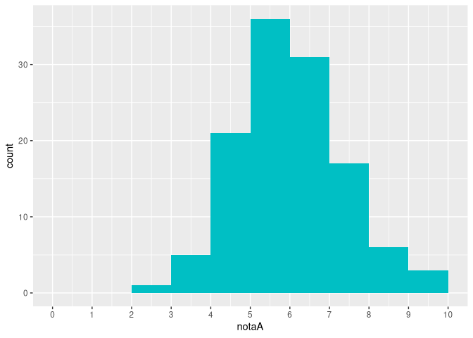
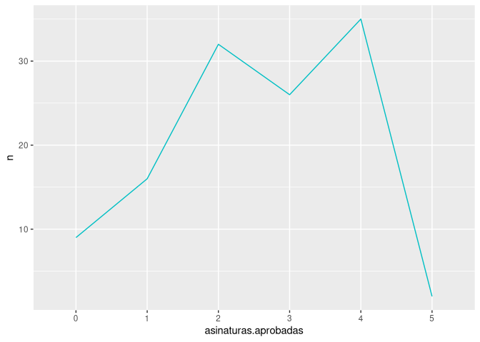
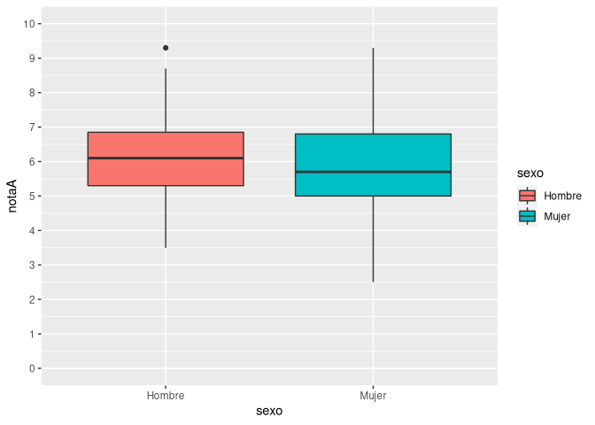

Los ejemplos de los distintos test que se presentan a continuación se han realizado a partir del siguiente conjunto de datos que contiene las notas y calificaciones de un curso. El fichero con los datos puede descargarse aquí para reproducir los estudios: [datos-curso.csv](datos/datos-curso.csv)

``` r
library(tidyverse)
```

## Una variable cuantitativa

### Estudios descriptivos

#### Estadísticos

-   Tamaño muestral
-   Media
-   Desviación típica
-   Mínimo, Máximo
-   Cuartiles
-   Coeficiente de asimetría
-   Coeficiente de apuntamiento

``` r
# Tamaño muestral
nrow(df)
```

    ## [1] 120

``` r
# Media
mean(df$notaA, na.rm = T)
```

    ## [1] 6.028333

``` r
# Desviación típica
sd(df$notaA, na.rm = T)
```

    ## [1] 1.340524

``` r
# Min, max
min(df$notaA, na.rm = T)
```

    ## [1] 2.5

``` r
max(df$notaA, na.rm = T)
```

    ## [1] 9.3

``` r
# Cuartiles
quantile(df$notaA, c(0.25, 0.5, 0.75), na.rm = T)
```

    ##   25%   50%   75% 
    ## 5.100 5.900 6.825

``` r
# Coef. asimetría
library(moments)
skewness(df$notaA, na.rm = T)
```

    ## [1] 0.1373915

``` r
# Coef. apuntamiento
kurtosis(df$notaA, na.rm = T) - 3
```

    ## [1] -0.102287

#### Gráficos

-   Diagrama de barras (variables discretas)

``` r
df %>% ggplot(aes(x = asinaturas.aprobadas)) + 
  geom_bar(fill="#00BFC4") + 
  # Cambio de escala del eje X
  scale_x_discrete(limits=0:5) 
```

    ## Warning: Continuous limits supplied to discrete scale.
    ## Did you mean `limits = factor(...)` or `scale_*_continuous()`?


-   Histograma

``` r
library(ggplot2)
# Límites de los intervalos
breaks = 0:10
# Histograma de las notasA
df %>% ggplot(aes(x = notaA)) + 
  geom_histogram(breaks = breaks, fill="#00BFC4") + 
  # Cambio de escala del eje X
  scale_x_continuous(limits=c(0, 10), breaks = 0:10) 
```



``` r
# Histograma de notasE
df %>% ggplot(aes(x = notaE)) + 
  geom_histogram(breaks = breaks, fill="#00BFC4") + 
  # Cambio de escala del eje X
  scale_x_continuous(limits=c(0, 10), breaks = 0:10) 
```

    ## Warning: Removed 2 rows containing non-finite values (stat_bin).


-   Diagrama de líneas

``` r
# Variables discretas
df %>% count(asinaturas.aprobadas) %>%
  ggplot(aes(x = asinaturas.aprobadas, y = n)) +
  geom_line(col="#00BFC4") + 
  # Cambio de escala del eje X
  scale_x_discrete(limits=0:5) 
```

    ## Warning: Continuous limits supplied to discrete scale.
    ## Did you mean `limits = factor(...)` or `scale_*_continuous()`?



``` r
# Agrupación de datos en intervalos
df %>% ggplot(aes(x = notaA)) + 
  geom_freqpoly(breaks = breaks, col="#00BFC4") + 
  # Cambio de escala del eje X
  scale_x_continuous(limits=c(0, 10), breaks = 0:10) 
```

    ## Warning: Removed 2 row(s) containing missing values (geom_path).


-   Diagrama de caja y bigotes

``` r
df %>% ggplot(aes(x = notaA)) + 
  geom_boxplot(fill="#00BFC4") +
  # Cambio de escala del eje X
  scale_x_continuous(limits=c(0, 10), breaks = 0:10)
```


### Estudios inferenciales

#### Test de normalidad de Shapiro-Wilk

**Objetivo**: Comprobar la normalidad de la distribución.

**Hipótesis nula**: La distribución es normal.

``` r
shapiro.test(df$notaA)
```

    ## 
    ##  Shapiro-Wilk normality test
    ## 
    ## data:  df$notaA
    ## W = 0.99424, p-value = 0.907

``` r
shapiro.test(df$notaE)
```

    ## 
    ##  Shapiro-Wilk normality test
    ## 
    ## data:  df$notaE
    ## W = 0.92264, p-value = 4.065e-06

#### Test t para la media de una población

**Objetivo**: Estimar la media de una variable o compararla con un valor
dado *μ*<sub>0</sub>.

**Requisitos**:

-   Una variable cuantitativa.
-   Distribución normal o tamaño muestral ≥ 30.

**Hipótesis nula**: La media de la población es igual a *μ*<sub>0</sub>.

**Ejemplo**: Comprobar si la nota media de un examen es diferente de 5.

``` r
t.test(df$notaA, mu = 5, alternative = "two.sided")
```

    ## 
    ##  One Sample t-test
    ## 
    ## data:  df$notaA
    ## t = 8.4033, df = 119, p-value = 1.08e-13
    ## alternative hypothesis: true mean is not equal to 5
    ## 95 percent confidence interval:
    ##  5.786023 6.270643
    ## sample estimates:
    ## mean of x 
    ##  6.028333

## Una variable cualitativa

### Estudios descriptivos

#### Estadísticos

-   Tamaños muestral
-   Frecuencias muestrales
-   Proporciones/porcentajes muestrales

``` r
# Tamaño muestral sin datos perdidos
length(na.omit(df$calificacionB))
```

    ## [1] 115

``` r
# Frecuencias
table(df$calificacionB)
```

    ## 
    ## Aprobado Suspenso 
    ##       98       17

``` r
# Proporciones
table(df$calificacionB) / length(na.omit(df$calificacionB))
```

    ## 
    ##  Aprobado  Suspenso 
    ## 0.8521739 0.1478261

``` r
# Porcentajes
table(df$calificacionB) / length(na.omit(df$calificacionB)) * 100
```

    ## 
    ## Aprobado Suspenso 
    ## 85.21739 14.78261

#### Gráficos

-   Diagrama de sectores

``` r
df %>% ggplot(aes(x = "", fill = calificacionA)) + 
  geom_bar() +
  # Cambiar a coordenadas polares
  coord_polar(theta = "y") +
  # Eliminar ejes
   theme_void()
```


### Estudios inferenciales

#### Test binomial para una proporción de una población

**Objetivo**: Estimar la propoción de una categoría en una población o
compararla con un valor *p*<sub>0</sub>.

**Requisitos**:

-   One variable cualitativa

**Hipótesis nula**: La proporción poblacional es igual a
*p*<sub>0</sub>.

**Ejemplo**: Comprobar si la proporción de aprobados es mayor de 0.5.

``` r
freq <- table(df$calificacionA)["Aprobado"]
binom.test(freq, n, p = 0.7, alternative = "greater")
```

    ## 
    ##  Exact binomial test
    ## 
    ## data:  freq and n
    ## number of successes = 94, number of trials = 120, p-value = 0.02657
    ## alternative hypothesis: true probability of success is greater than 0.7
    ## 95 percent confidence interval:
    ##  0.7123183 1.0000000
    ## sample estimates:
    ## probability of success 
    ##              0.7833333

#### Test Z para la proporción de una población

**Objetivo**: Estimar la propoción de una categoría en una población o
compararla con un valor *p*<sub>0</sub>.

**Requisitos**:

-   Una variable cualitativa
-   Tamaño muestral >= 30

**Observación**: Utiliza la aproximación normal de la distribución
Binomal.

**Ejemplo**: Comprobar si la proporción de aprobados es mayor de 0.5.

``` r
freq <- table(df$calificacionA)["Aprobado"]
prop.test(freq, n, p = 0.7, alternative = "greater")
```

    ## 
    ##  1-sample proportions test with continuity correction
    ## 
    ## data:  freq out of n, null probability 0.7
    ## X-squared = 3.5813, df = 1, p-value = 0.02922
    ## alternative hypothesis: true p is greater than 0.7
    ## 95 percent confidence interval:
    ##  0.7111099 1.0000000
    ## sample estimates:
    ##         p 
    ## 0.7833333

## Dos variables: Variable dependiente cuantitativa y variable independiente culitativa con dos categorías o grupos

### Estudios descriptivos

#### Estadísticos

-   Tamaño muestral de cada grupo
-   Media de cada grupo
-   Desviación típica de cada grupo
-   Mínimo, Máximo de cada grupo
-   Cuartiles de cada grupo
-   Coeficiente de asimetría de cada grupo
-   Coeficiente de apuntamiento de cada grupo

``` r
# Tamaño muestral de notaA según el sexo
df %>% group_by(sexo) %>% group_size()
```

    ## [1] 71 49

``` r
# Media, Desviación típica, Mín, Máx, Cuartiles, Coef. Asimetría y Coef. Apuntamiento
library(moments)
df %>% group_by(sexo) %>% summarize(Media = mean(notaA, na.rm=TRUE), Des.Tip = sd(notaA, na.rm = T), Mín = min(notaA), Máx = max(notaA), C1 = quantile(notaA, 0.25, na.rm = T), C2 = quantile(notaA, 0.5, na.rm = T), C3 = quantile(notaA, 0.75, na.rm = T), Coef.Asimetría = skewness(notaA, na.rm = T), Coef.Apuntamiento = kurtosis(notaA, na.rm = T))
```

    ## # A tibble: 2 x 10
    ##   sexo   Media Des.Tip   Mín   Máx    C1    C2    C3 Coef.Asimetría Coef.Apuntamiento
    ##   <chr>  <dbl>   <dbl> <dbl> <dbl> <dbl> <dbl> <dbl>          <dbl>             <dbl>
    ## 1 Hombre  6.12    1.23   3.5   9.3   5.3   6.1  6.85          0.249              2.83
    ## 2 Mujer   5.89    1.49   2.5   9.3   5     5.7  6.8           0.135              2.76

#### Gráficos

-   Diagrama de cajas y bigotes

``` r
df %>% ggplot(aes(x = sexo, y = notaA, fill = sexo)) + 
  geom_boxplot() +
  # Cambio de escala del eje X
  scale_y_continuous(limits=c(0, 10), breaks = 0:10)
```



-   Diagrama de violín

``` r
df %>% ggplot(aes(x = sexo, y = notaA, fill = sexo)) + 
  geom_violin() +
  # Cambio de escala del eje X
  scale_y_continuous(limits=c(0, 10), breaks = 0:10)
```


### Estudios inferenciales

#### Test de normalidad de Shapiro-Wilks

**Objetivo**: Comprobar la normalidad de la distribución.

**Hipótesis nula**: La distribución es normal.

``` r
df %>% group_by(sexo) %>% 
  summarise(`Estadístico W` = shapiro.test(notaA)$statistic, `p-valor` = shapiro.test(notaA)$p.value)
```

    ## # A tibble: 2 x 3
    ##   sexo   `Estadístico W` `p-valor`
    ##   <chr>            <dbl>     <dbl>
    ## 1 Hombre           0.990     0.872
    ## 2 Mujer            0.990     0.942

#### Test F de Fisher de comparación de varianzas de dos poblaciones independientes

**Objetivo**: Comparar las varianzas de dos poblaciones independientes.

**Requisitos**:

-   Variable dependiente cuantitativa.
-   Una variable independiente cualitativa con dos categorías
    (poblaciones)
-   Distribución normal de la variable dependiente en ambas poblaciones
    o tamaños de las muestras de cada población ≥ 30.

**Hipótesis nula**: La varianzas poblacionales son iguales (no existe
una diferencia significativa entre las medias poblacionales).

**Ejemplo**: Comprobar si diferencias signicativas entre las notas
medias de hombres y mujeres.

``` r
# Test de comparación de varianzas
var.test(notaA ~ sexo, data = df)
```

    ## 
    ##  F test to compare two variances
    ## 
    ## data:  notaA by sexo
    ## F = 0.6769, num df = 70, denom df = 48, p-value = 0.1347
    ## alternative hypothesis: true ratio of variances is not equal to 1
    ## 95 percent confidence interval:
    ##  0.3953421 1.1293155
    ## sample estimates:
    ## ratio of variances 
    ##          0.6769032

#### Test t de comparación de medias de dos poblaciones independientes

**Objetivo**: Estimar la media de una variable o compararla con un valor
dado *μ*<sub>0</sub>.

**Requisitos**:

-   Variable dependiente cuantitativa.
-   Una variable independiente cualitativa con dos categorías
    (poblaciones)
-   Distribución normal de la variable dependiente en ambas poblaciones
    o tamaños de las muestras de cada población ≥ 30.

**Hipótesis nula**: La medias poblacionales son iguales (no existe una
diferencia significativa entre las medias poblacionales).

**Observación**: El resultado del test depende de si las varianzas
poblacionales son iguales o no.

**Ejemplo**: Comprobar si diferencias signicativas entre las notas
medias de hombres y mujeres.

``` r
# Test de comparación de varianzas
var.test(notaA ~ sexo, data = df)
```

    ## 
    ##  F test to compare two variances
    ## 
    ## data:  notaA by sexo
    ## F = 0.6769, num df = 70, denom df = 48, p-value = 0.1347
    ## alternative hypothesis: true ratio of variances is not equal to 1
    ## 95 percent confidence interval:
    ##  0.3953421 1.1293155
    ## sample estimates:
    ## ratio of variances 
    ##          0.6769032

``` r
# Test de comparación de medias asumiendo varianzas iguales
t.test (notaA ~ sexo, data = df, alternative = "two.sided", var.equal = FALSE)
```

    ## 
    ##  Welch Two Sample t-test
    ## 
    ## data:  notaA by sexo
    ## t = 0.89364, df = 89.873, p-value = 0.3739
    ## alternative hypothesis: true difference in means between group Hombre and group Mujer is not equal to 0
    ## 95 percent confidence interval:
    ##  -0.2821809  0.7435779
    ## sample estimates:
    ## mean in group Hombre  mean in group Mujer 
    ##             6.122535             5.891837

``` r
# Test de comparación de medias asumiendo varianzas iguales
t.test (notaA ~ sexo, data = df, alternative = "two.sided", var.equal = TRUE)
```

    ## 
    ##  Two Sample t-test
    ## 
    ## data:  notaA by sexo
    ## t = 0.92608, df = 118, p-value = 0.3563
    ## alternative hypothesis: true difference in means between group Hombre and group Mujer is not equal to 0
    ## 95 percent confidence interval:
    ##  -0.262615  0.724012
    ## sample estimates:
    ## mean in group Hombre  mean in group Mujer 
    ##             6.122535             5.891837

-   Diagrama de medias

``` r
df %>% ggplot(aes(x = sexo, y = notaA, colour = sexo)) + 
  # Puntos de medias
  stat_summary(fun="mean", size=3,  geom="point", position=position_dodge(width=0.25)) + 
  # Intervalos de confianza para la media
  stat_summary(fun.data = function(x) mean_cl_normal(x, conf.int=0.95), geom = "pointrange", position=position_dodge(width=0.25)) 
```


