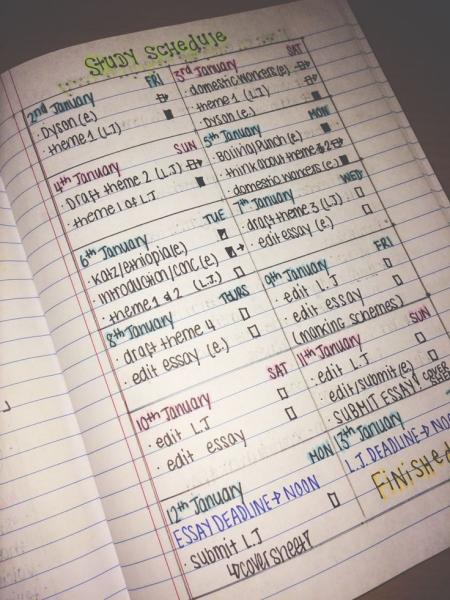

En este artículo ofrezco varios consejos o buenas prácticas para ayudar a estudiantes de grado, especialmente durante su primer año, para sacarle el máximo partido a las clases, rentabilizar mejor su trabajo y culminar su proceso de aprendizaje con éxito.

<!--more-->

Los consejos que aquí aparecen se dan desde la experiencia de bastantes años de docencia, y teniendo en cuenta sobre todo, que el autor también fue y sigue siendo alumno.

La mayoría de estos consejos pueden parecer obvios pero muchos estudiantes los ignoran o fracasan al intentar ponerlos en práctica.

## Motivación

La primera condición para lograr el éxito, no sólo en una titulación, sino en cualquier proyecto que se emprenda a lo largo de la vida, es la _motivación_.
Sin motivación, lo más fácil es que a las primeras dificultades o inconvenientes que aparezcan tiremos la toalla, y debemos tener presente que seguro habrá dificultades.
Conviene tener siempre presente las razones por las que se emprende el camino, y visualizar la meta.
Es decir, caminar con un ojo puesto en el horizonte para saber hacia dónde nos dirigimos, y con el otro puesto en el camino para no tropezar.

Es cierto que a veces se acaba en una carrera por imposición (de los padres, del mercado laboral, etc.), pero incluso en estos casos hay que ser positivos y pensar que lo que se aprenda sin duda nos hará mejores y seguramente nos servirá en un futuro.
Además, en el peor de los casos hay que pensar que ¡cuanto antes se pase el trago mejor!, por lo que conviene poner toda la carne en el asador.

Una grado supone mucho esfuerzo y sacrificio, pero debemos pensar que la mayor parte de las personas que comienza una grado lo acaba con éxito, muchas de ellas menos inteligentes que tú, que han pasado por las mismas dificultades y al final han superado los obstáculos. Si conoces a alguna, su consejo puede serte muy útil.

## Toma la iniciativa

En el proceso de aprendizaje, la alumna no es el objeto al cual hay que dotar de una serie de conocimientos y capacidades, sino el propio sujeto de su formación.
La alumna está acostumbrada a seguir el rumbo que marca la profesora, los padres, la tutora, pero realmente es ella quien, una vez motivada, debe llevar la iniciativa en el proceso de aprendizaje, pues lo que está en juego es su formación y desarrollo integral.
Este convencimiento debe llevar a la alumna a ir incluso por delante de sus docentes, preparando anticipadamente los capítulos del curso, trabajando ejercicios no propuestos, ampliando la documentación sobre los temas de clase, etc.
De esta manera, la alumna no sólo aprenderá más, más rápido y mejor, sino que al mismo tiempo se estará preparando para su futuro profesional, en el que en muchas ocasiones no contará con nadie que le dirija o le aconseje sobre los problemas que se le presenten en su trabajo.

### ¿Qué supone tomar la iniciativa?

- Explorar la materia por uno mismo.
- Preparar anticipadamente las clases.
- Intentar resolver los problemas sin ayuda.
- Ampliar la información dada en clase con otras fuentes.
- Intentar aplicar lo aprendido a tu propia vida o en otros contextos.
- Dar rienda suelta a tu curiosidad y creatividad.

## La profesora es tu aliada

 A menudo solemos pensar desgraciadamente que una profesora la tiene tomada con nosotras, que su objetivo es hacernos la vida imposible.
 En otras ocasiones, la vemos más como una juez que al final del curso emitirá el veredicto (aprobado o suspenso).
 Sin embargo, a pesar de la desagradable tarea de evaluar, el principal objetivo de una profesora es enseñar.
 Es cierto que a veces puede haber roces personales entre profesora y alumna, al igual que puede haberlos en una familia o entre personas cualesquiera que mantienen algún tipo de relación, pero en la inmensa mayoría de los casos, las acciones de una profesora, con mayor o menor motivación, mayor o menor éxito, tienen como único fin el aprendizaje de sus alumnas.
 Así que _¡cambia el chip!_, piensa en tu profesora como en una aliada, no como una enemiga.

## Saca el máximo partido a tus clases

Las clases presenciales no son la única forma de aprender, pero sí una de las más efectivas, aunque para ello es necesario saber aprovecharlas.
Asistir a clase sólo por el hecho de firmar la lista de asistencia o de que la profesora me vea, sin otro interés, prácticamente no sirve de nada, y puede llegar a ser incluso contraproducente.
Así pues, si asistes a una clase, olvida otras asignaturas o asuntos y trata de poner los cinco sentidos en el tema que se trata en la clase.

Por otro lado, también necesitas hacer un uso adecuado de cada tipo de clase.
Cuando se trata de una clase magistral, donde se da una introducción a un nuevo tema, es importante quedarse con las ideas principales y su estructura, y no preocuparse demasiado por los detalles y por anotar absolutamente cada palabra de la profesora.

Un seminario, por contra, trata de profundizar en un tema concreto.
Por tanto, es buena idea acudir con una preparación previa del tema a tratar.
De este modo, la clase será sin duda mucho más provechosa ya que rápidamente se aterrizará sobre las dudas o los aspectos menos claros.

Finalmente, si se trata de una clase de ejercicios, resulta imprescindible haberlos intentado previamente para identificar las principales dificultades o los _callejones sin salida_.
De esta forma, una vez en clase, podremos detenernos justo en esos puntos y aprender realmente lo que nos faltaba por conocer o lo que estábamos haciendo mal.
Si nos limitamos a copiar de la pizarra las resoluciones de los ejercicios, sin haberlos intentado previamente, lo más seguro es que no identifiquemos el conocimiento clave, o la técnica necesaria para resolver cada tipo de ejercicio, y que posteriormente no sepamos aplicarlas en ejercicios similares.

Cuando la materia lo permite también puedes pedirle al profesor que invierta la clase.

### ¿Qué es una clase invertida?

 La clase invertida trata de darle la vuelta a la metodología clásica de enseñanza en la que la alumna se enfrenta por primera vez a los contenidos teóricos de la materia fuera de la clase, habitualmente leyendo libros o visualizado videos, y el tiempo de clase se dedica al trabajo más duro de asimilación del conocimiento por medio de resolución de dudas, resolución de problemas o debates.

## Pregunta sin miedo

En relación con el punto anterior, para un mejor aprovechamiento de las clases es imprescindible la interacción alumna-profesora o alumna-alumna.
La profesora, por muy avispada que sea, la mayoría de las veces no sabrá si una alumna no comprende un concepto o se ha perdido en un desarrollo.
Sólo si la alumna pregunta o muestra signos de no haber comprendido una explicación, la profesora podrá repetirla o poner más ejemplos para su comprensión.
El miedo al ridículo suele ser el principal inconveniente a la hora de preguntar, sobre todo de las alumnas de primer curso.
Debemos aprender a vencer la timidez y el miedo al ridículo, porque en la mayoría de los casos nuestras dudas seguro que son generalizadas en la clase, e incluso cuando no lo sean, debemos convencernos de que _la pregunta más estúpida es aquélla que no se hace_.

La retroalimentación es un aspecto esencial para asegurar un progreso sólido en cualquier proceso de aprendizaje.

## Aprovecha las tutorías

Una de las principales ventajas de los centros privados como este es la facilidad para acceder a las profesoras.
Si tenemos claro que la profesora es nuestra aliada no deberíamos dudar en utilizar las tutorías cada vez que se presente algún problema.

Cada alumna debe tener asignada una tutora cuya función es informarle y asesorarle sobre cualquier duda de tipo académico que pueda tener durante el curso, desde la matrícula, hasta los exámenes. Si no conoces cual es tu tutora, pregúntalo en secretaría y concierta una entrevista con ella cuanto antes para presentaros mutuamente.
Cada vez que tengas un problema o surja un incidente que no sepas cómo resolver acude a ella.
Incluso en el caso de que no haya ningún tipo de incidente deberías visitar a tu tutora regularmente (sobre todo después de las evaluaciones) para revisar juntas la marcha del curso.
Piensa que cuanto más conozca una tutora sobre ti y sobre tu trayectoria en la universidad, mejor podrá ayudarte.

Por otro lado, cada profesora que te imparta una asignatura tiene asignadas unas horas para tutorías.
Las tutorías suelen realizarse en el despacho de la profesora en la hora fijada para las mismas. 

Utiliza las tutorías para:

- Pedir consejo a la profesora sobre cómo estudiar un determinado tema.
- Resolver dudas o aclarar conceptos que no has entendido bien (especialmente si has faltado a alguna clase).
- Pedir ayuda si no eres capaz de resolver algún ejercicio.
- Revisar tus exámenes.

Pero también debes tener en cuenta que: 

- Las tutorías no son clases particulares. 
  Esto quiere decir que no están pensadas para repetir una clase dada al grupo, ni para hacer ejercicios con la alumna.
  A una tutoría hay que acudir con un problema concreto o para resolver una duda concreta, lo que supone que la alumna se ha documentado sobre la cuestión y ha habido un trabajo previo por su parte.

- Respeta el horario de las tutorías.
  La mayor parte de las profesoras promueven el uso de las tutorías porque además son una forma de interactuar con la alumna para conocerse mejor y ver su evolución.
  Sin embargo, las profesoras suelen tener otras ocupaciones además de la docencia por lo que, en la medida de lo posible, intenta no acudir a una tutoría fuera de su horario para no interrumpir su trabajo.
  Si no puedes acudir a una tutoría en la hora establecida, pide cita a la profesora.

## Documéntate, lee y escribe

  

Otras de las claves para el éxito es disponer de una buena documentación que complemente lo visto en clase.
Muchas alumnas tienden a creer que la única información importante a tener en cuenta es la provista por la profesora.
Incluso si sólo se piensa en superar los exámenes esto es un error, ya que la información que puede ofrecer una profesora en clase es limitada, incompleta, y a veces errónea (desgraciadamente las profesoras también se equivocan).
Por tanto, una buena documentación te puede ayudar no sólo a contrastar lo visto en clase con otras fuentes, sino a comprender mejor lo explicado, y a ampliarlo viendo nuevos ejemplos, descubriendo nuevas aplicaciones, etc.

Para cada asignatura deberías tener dos o tres libros de referencia durante el curso.
En las guías docentes aparece la bibliografía recomendada por las profesoras de la asignatura.
Empieza por mirar los libros básicos (la mayoría estarán disponibles en la biblioteca de la universidad), pero no te conformes con eso.
Es posible que haya un libro muy bueno sobre una materia pero con el que te cueste comprender las cosas, de modo que no te sirva de mucho.
_¡Cada una debe buscar su libro!_ Por eso es importante que busques aquellos libros que te permitan comprender la materia y con los que te sientas cómoda.
Si no encuentras ninguno que te satisfaga entre los propuestos en la bibliografía de la asignatura, pregúntale a la profesora por otros libros o busca más información en Internet.
Sobre todo nunca compres un libro antes de haberlo mirado en profundidad.

Una vez se disponga de una documentación apropiada, debe realizarse una lectura comprensiva de la misma.
Esto muchas veces exige leer varias veces el texto, acudir al diccionario cuando no se conozca alguna palabra, subrayar las ideas claves y anotar el texto complementando la información con alguna aclaración o ejemplo.
Nunca se debe aprender de memoria algo si no se llega a comprender perfectamente.

Por otro lado, es muy importante, a la hora de estructurar y asentar las ideas adquiridas sobre un tema, escribir sobre él.
Está más que comprobado que escribir sobre un tema ayuda a pensar mejor y a razonar con más rigor.
Un recurso muy utilizado es el desarrollo de esquemas o resúmenes que ayuden a sintetizar los conceptos más importantes en pocas páginas, y que además pueden servir para un repaso posterior del tema.
También puede ser muy útil hacer pequeñas presentaciones de cada tema.
Además, debe tenerse en cuenta que la mayoría de las pruebas de evaluación son escritas, por lo que es importante el entrenamiento en la escritura.

## Trabaja en grupo

El trabajo en grupo es importante, no sólo desde el punto de vista del aprendizaje, sino porque además ayuda a desarrollar los hábitos sociales.
En la mayoría de las ocupaciones profesionales es natural trabajar en equipo, pues la resolución de determinadas tareas o problemas se simplifica cuando se trabaja cooperativamente.
En la enseñanza ocurre algo parecido, pues el aprendizaje colaborativo suele ser más rápido y mejor (y más divertido).
De esta manera, el trabajo en grupo es útil en muchos aspectos:

- Ayuda a desarrollar habilidades sociales.
- Refuerza la motivación de la alumna al sentirse miembro de un equipo.
- Enriquece el aprendizaje con la aportación de otros puntos de vista.
- Ayuda a desarrolla la capacidad crítica de la alumna.

Pero aprender a trabajar en grupo no es fácil.
Un grupo maduro es aquél en el que hay plena participación de sus miembros a la hora de tomar decisiones y de repartir tareas, y donde cada miembro asume su responsabilidad en la parte del trabajo que le corresponda, apoyándose en los demás cuando sea necesario.
Adquirir las habilidades de trabajo en grupo lleva tiempo y sobre todo práctica, por eso cuanto antes empieces mejor.
Si la profesora no organiza grupos de trabajo, crea junto a tus compañeras tus propios grupos de estudio o trabajo.

## Organízate

Muchas veces el fracaso no es debido a una falta de motivación o de trabajo, sino a una mala planificación.
Es esencial hacer una buena planificación al comienzo del curso que contemple no sólo los horarios de clases, prácticas o las fechas de exámenes, sino también la organización del tiempo de trabajo fuera de la universidad.
Lo más importante de esta planificación es que sea realista, es decir que si sólo disponemos de un par de horas para trabajar en casa, no contemos con más, pero tampoco con menos, y que hagamos un reparto razonable de las mismas, asignando más tiempo a las materias más complejas o que requieran más trabajo.
Una buena pista del tiempo de trabajo que requiere cada asignatura es su número de créditos ECTS.
Es recomendable revisar dicha planificación con la tutora.
Una vez realizada la planificación, lo más importante es ser fiel a la misma, teniéndola presente en todo momento a lo largo del curso.

## Revisa regularmente la marcha del curso

Dentro de la planificación del curso deben establecerse varias fechas, convenientemente espaciadas, para hacer una revisión parcial del camino recorrido y lo que queda por recorrer.
Estas revisiones tienen por objeto hacer una pequeña autoevaluación sobre el proceso de aprendizaje, hasta qué punto se están cumpliendo los objetivos fijados y si estamos siendo fieles a las pautas marcadas por este manual de supervivencia.
De este modo podremos identificar las principales dificultades en el aprendizaje y aquello en lo que estamos fallando, para corregir el rumbo a tiempo.
En el peor de los casos, incluso si al final del curso no logramos superar alguna asignatura, es muy importante hacer una revisión final tratando de identificar las causas para _aprender de los errores_ y que no se vuelvan a repetir en futuros cursos.
No te desanimes y piensa que aunque no hayas superado la asignatura, seguro que no has perdido por completo el año. Se positiva y piensa en todo aquello que has aprendido y que sin duda te aportará experiencia para tu vida.

## Revisa regularmente estos consejos

Por último, no te olvides de revisar y refrescar estos consejos.
