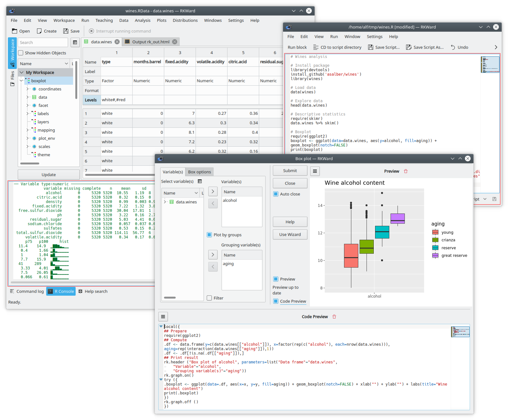

_¿Necesitas ayuda con el analizar datos en tus estudios o trabajo?_

No te preocupes, porque la Estadística ahora está al alcance de cualquiera con el paquete **rkTeachig**, un paquete de R que he desarrollado para facilitar el aprendizaje de Estadística.

<!--more-->

RKTeaching es software libre, y por tanto es gratuito.
Además está diseñado para poder realizar los procedimientos estadísticos más habituales sin necesidad de conocer el lenguaje R ya que dispone de menús y cuadros de diálogos especialmente diseñados para facilitar la aplicación de estos procedimientos.

Si estás interesado en sus características, no lo dudes, visita la página de rkTeaching(/es/proyecto/rkteaching)

