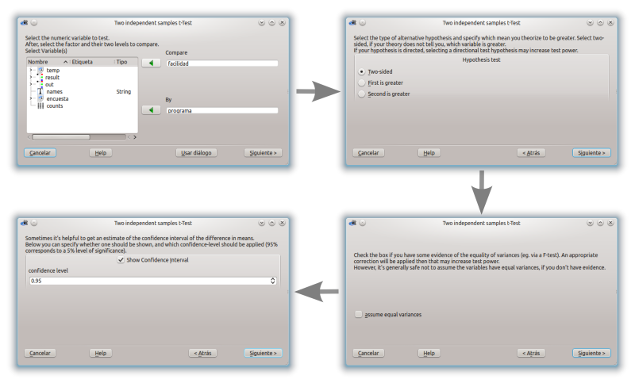

{}

## ¿Qué es rkTeaching?

rkTeaching es un paquete de [R](http://www.r-project.org/) que proporciona un plugin para la interfaz gráfica [RKWard](http://rkward.sourceforge.net/) añadiendo nuevos menús y cuadros de diálogo especialmente diseñados para la enseñanza de Estadística.

El paquete ha sido desarrollado y es mantenido por Alfredo Sánchez Alberca <asalber@ceu.es> del Departamento de Matemáticas de la Universidad San Pablo CEU de Madrid.

Si descubre algún error o tiene cualquier sugerencia, por favor, envíeselo por correo al autor o bien indíquelo como un [issue en Github](https://github.com/asalber/rkTeaching_es/issues).


## Instalación

### Instalación en Windows

Para usuarios de plataformas Windows existe un programa de instalación que incluye R, RKWard y rkTeaching.

- [Descarga la última versión (R versión 4.3, RKWard versión 0.8, rkTeaching versión 1.3.0)](https://drive.google.com/file/d/1Zrj3zU3ztSFsgGttcEHp9CV8ECSTG5qL/view?usp=drive_link)

- [Descarga la versión anterior (R versión 3.6.2, RKWard versión 0.7.1b, rkTeaching versión 1.3.0)](https://drive.google.com/file/d/17eWedHkSI1f0pIjAra94HOwagchr-h7T/view?usp=sharing)

Una vez descargado el fichero, sólo hay que ejecutarlo para descomprimirlo.
Al ejecutarse aparecerá un cuadro de diálogo donde preguntará por la unidad y el directorio de instalación y es importante indicar que se instale en la carpeta raíz del disco duro C, es decir en la dirección `C:\`, tras esto se creará una carpeta `RKWard` y dentro de ella la carpeta bin donde se encuentra el fichero `rkward.exe` que hay que ejecutar para arrancar RKWard.

El siguiente vídeo muestra el proceso de instalación.



### Instalación en Mac Os

Para instalar el software en plataformas Mac Os debe instalarse cada programa por separado con el siguiente orden:

1.  **Instalar R**. R puede descargarse desde la página [https://cran.r-project.org/](https://cran.r-project.org/bin/macosx/).
    Se recomienda instalar la versión 4.3 para MacOs. Dependiendo el procesador del ordenador debe seleccionarse la versión `arm65` para ordenadores con un chip silicon (M1-3) o la versión `x86` para ordenadores con chip de Intel.

    -  [R versión 4.3 para MacOs con chip silicon (M1-3)](https://cran.r-project.org/bin/macosx/big-sur-arm64/base/R-4.3.3-arm64.pkg)
    -  [R versión 4.3 para MacOs con chip de Intel (x86)](https://cran.r-project.org/bin/macosx/big-sur-x86_64/base/R-4.3.3-x86_64.pkg)

1.  **Instalar RKWard**. RKWard puede descargarse desde la página <https://rkward.kde.org/>. 
Debe seleccionarse la distribución correspondiente a Mac Os (<https://rkward.kde.org/RKWard_on_Mac.html>) y seguir las instrucciones de instalación que allí se especifican.
Es importante asegurase de tener una versión de Mac OS X 10.15 o superior, ya que RKWard no funciona con versiones anteriores.

    Si hay algún error en la instalación, consultar las posibles soluciones en (<http://rkward.sourceforge.net/wiki/RKWard_on_Mac#Troubleshooting>)

1.  **Instalar los paquetes de los que depende rkTeaching**. Para instalar rkTeaching primero hay que instalar los paquetes de R de los que depende.
Para ello, hay que ejecutar R en línea de comandos, o bien arrancar RKWard e ir a la solapa de la Consola de R (R console) e introducir los siguientes comandos:

    ```R
    install.packages(c("R2HTML","car","e1071","Hmisc", "ez", "multcomp", "psych", "probs", "tidyverse", "knitr", "kableExtra", "remotes"))
    ```

1.  **Instalar rkTeaching**. La mejor forma de instalar rkTeaching desde este repositorio es utilizando el paquete de R `remotes`.
Para ello hay que introducir los siguientes comandos en la consola de R: 

    ```R
    library(remotes)
    install_github("rkward-community/rk.Teaching")
    ```

    El siguiente vídeo muestra el proceso de instalación.

    

#### Instalación en MacOs mediante WMware Fusion

Si el procedimiento anterior no funciona, es posible instalar una máquina virtual con RKward ya instalado mediante el software WMware Fusion. Para ello deben seguirse los siguientes pasos:

1.  **Instalar WMware Fusion**. WMware Fusion es un software de virtualización que permite instalar sistemas operativos Windows o Linux en un Mac. [Descargar WMware Fusion](https://www.techspot.com/downloads/2755-vmware-fusion-mac.html) y seguir las instrucciones de instalación.

2.  Descargar la máquina virtual con RKWard ya instalado. 
   
    - [Descargar máquina virtual con RKWard versión 0.8 y rkTeaching 1.4](https://ceu365-my.sharepoint.com/:u:/g/personal/asalber_ceu_es/EaRxOdvlm-pEo9ZemESsKgABH2LSM4IyWuhsOm2O4iVCRQ?e=RJtxER)
    - [Descargar máquina virtual con RKWard versión 0.7 y rkTeaching 1.3](https://ceu365-my.sharepoint.com/:u:/g/personal/asalber_ceu_es/EcK0P2-es1pOl-3HtRYHn4sBswcpiil5q6QwVp01i0o0yA?e=fWtpe0)

3.  Arrancar WMware Fusion y abrir la máquina virtual descargada. La máquina virtual arrancará con RKWard ya instalado y listo para su uso.

### Instalación en Linux

Para instalar el software en plataformas Linux debe instalarse cada programa por separado con el siguiente orden:

1.  **Instalar R**. R puede descargarse desde la página <http://cran.es.r-project.org/>. 
Debe seleccionarse la distribución correspondiente a Linux y seguir las instrucciones de instalación que allí se especifican.
Es necesario que la versión de R sea la 3.0 o superior.

    En sistemas Debian y Ubuntu, puede instalarse desde la línea de comandos con el comando:

    ```sh
    sudo apt-get install r-base
    ```

2.  **Instalar RKWard**. RKWard puede descargarse desde la página <https://rkward.kde.org/>. 
Debe seleccionarse la distribución correspondiente a Linux y seguir las instrucciones de instalación que allí se especifican.

    En sistemas Debian y Ubuntu, puede instalarse desde la línea de comandos con el comando:

    ```sh
    sudo apt-get install rkward
    ```

    Es importante asegurarse de que la versión instalada es la 0.7.2 o superior.

3. **Instalar los paquetes de los que depende rkTeaching**. Para instalar rkTeaching primero hay que instalar los paquetes de R de los que depende. 
Para ello, hay que ejecutar R en línea de comandos, o bien arrancar RKWard e ir a la solapa de la Consola de R (R console) e introducir los siguientes comandos:

    ```R
    install.packages(c("R2HTML","car","e1071","Hmisc", "ez", "multcomp", "psych", "probs", "tidyverse", "knitr", "kableExtra", "remotes"))
    ```

4. **Instalar rkTeaching**. La mejor forma de instalar rkTeaching desde este repositorio es utilizando el paquete de R `remotes`.
Para ello hay que introducir los siguientes comandos en la consola de R: 

    ```R
    library(remotes)
    install_github("rkward-community/rk.Teaching")
    ```

    El siguiente vídeo muestra el proceso de instalación.

    

## Procedimientos estadísticos

Una vez instalado, al arrancar RKWard aparecerá un nuevo menú `Teaching` con los siguientes procedimientos estadísticos:

- Manipulación de datos
  - Filtrar datos
  - Calcular variable
  - Recodificar variable
  - Ponderar datos
  - Tipificar variables
- Distribución de frecuencias
  - Tablas de frecuencias
  - Tablas de frecuencias bidimensionales
- Gráficos
  - Diagrama de barras
  - Histograma
  - Diagrama de sectores
  - Diagrama de caja
  - Diagrama de medias
  - Diagrama de interacción
  - Diagrama de dispersión
  - Diagrama de lineas
  - Matriz de dispersión
- Estadística descriptiva
  - Estadísticos
  - Estadísticos (cálculo detallado)
- Regresión
  - Regresión lineal
  - Regresión no lineal
  - Comparación de modelos
  - Predicciones
  - Correlación
- Test paramétricos
  - Medias
    - Test T para una muestra
    - Test T para dos muestras independientes
    - Test T para dos muestras pareadas
    - ANOVA
    - Cálculo del tamaño muestral para la media
    - Cálculo del tamaño muestral para el test T
    - Cálculo de la potencia de un test T
  - Varianzas
    - Test para la varianza de una población
    - Test F de Fisher
    - Test de Levene
  - Proporciones
    - Test para una proporción
    - Test para dos proporciones
    - Cálculo del tamaño muestral para una proproción
- Test no paramétricos
  - Normalidad
    - Test de Lilliefors (Komogorov-Smirnov)
    - Test de Shapiro-Wilk
  - Test U de Mann-Whitney para dos muestas independientes
  - Test de Wilcoxon para dos muestras pareadas
  - Test de Kruskal-Wallis para varias muestras independientes
  - Test de Friedman para medidas repetidas
  - Test Chi-cuadrado de independencia
  - Test Chi-cuadrado de bondad de ajuste
- Concordancia
  - Coeficiente de correlación intraclase
  - Kappa de Cohen
- Probabilidad
  - Juegos de azar
    - Monedas
      - Espacio probabilístico
      - Lanzamiento de monedas
    - Dados
      - Espacio probabilístico
      - Lanzamiento de dados
    - Naipes
      - Espacio probabilístico
      - Extracción naipes
    - Urnas
      - Espacio probabilístico
      - Extracción de urnas
  - Construcción de espacio probabilístico
  - Combinación de espacios probabilísticos
  - Repetición de espacios probabilísticos
  - Cálculo de probabilidad
- Distribuciones de probabilidad
  - Distribuciones discretas
    - Binomial
      - Probabilidades
      - Cuantiles
      - Gráfico de probabilidad
    - Poisson
      - Probabilidades
      - Cuantiles
      - Gráfico de probabilidad
  - Distribuciones continuas
    - Chi-cuadrado
      - Probabilidades
      - Cuantiles
      - Gráfico de probabilidad
    - F de Fisher
      - Probabilidades
      - Cuantiles
      - Gráfico de probabilidad
    - Normal
      - Probabilidades
      - Cuantiles
      - Gráfico de probabilidad
    - T de student
      - Probabilidades
      - Cuantiles
      - Gráfico de probabilidad
    - Uniforme continua
      - Probabilidades
      - Cuantiles
      - Gráfico de probabilidad
- Simulaciones
  - Ley de los casos raros

## Funcionalidades

- Menús y cuadros de diálogo diseñados para facilitar el aprendizaje, eliminando todas las opciones secundarias para conseguir una interfaz simple e intuitiva.

- Diseño de asistentes que guían al usuario paso a paso y le asesoran en los análisis estadísticos.
  

- Salidas en HTML que presentan los resultados de los análisis y sus     interpretaciones de manera clara y concisa.
  

- Gráficos sencillos basados en el moderno paquete ggplot2.
  

- Posibilidad mostrar el desarrollo de los cálculos de algunos
    procedimientos estadísticos. 
    

rkTeaching es mantenido por [asalber](https://github.com/asalber).

## ¿Cómo citar rkTeaching?

Sánchez-Alberca, A. (2024). rkTeaching (version 1.4) [software]. Obtenido de: http://aprendeconalf.es/es/proyecto/rkteaching.